# Security Hardening and Traffic Analysis

COIT20246 Cyber Security and Networking — Term 2, 2026
SYD Group 6 — Md Arman Joarder (12312653), Atikur Rahman Mimmoy (12327451)

All work in this section was carried out on the OpenWRT VM provided in this unit (OpenWrt 22.03.3, r20028-43d71ad93e), the same VM documented in `network.md`.

---

## 1. Hardening the OpenWRT System

### 1.1 Change the Default Root Password

**The risk this addresses.** The OpenWRT VM ships with a default root password that is identical on every copy of the image, so everyone who has used that image already knows it. Default credentials are one of the most common ways small business routers are compromised, and automated tools scan for them constantly. For Westline IT Solutions, root access to the router means control of the firewall, routing and DNS for the whole office.

**Before — the default password is still in place.**

```sh
cat /etc/shadow
```

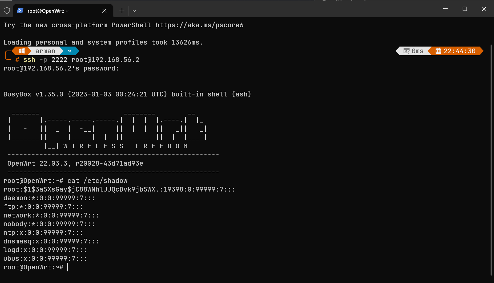

```
root:$1$3a5XsGay$jC88WNh...:19398:0:99999:7:::
```

The third field, `19398`, is the number of days since 1 January 1970 on which the password was last changed — **10 February 2023**, the date the image was built. It had never been changed.

**The change.**

```sh
passwd
```

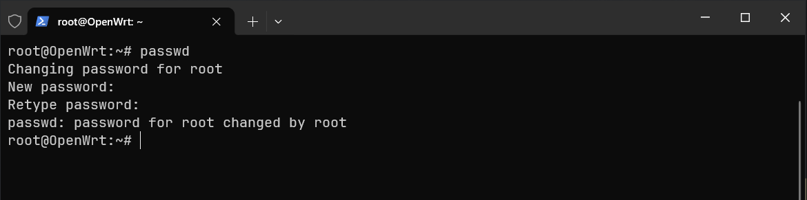

**After — a new hash is stored.**

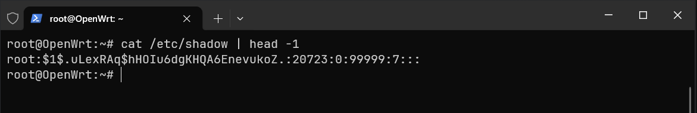

```
root:$1$.uLexRAq$hHOIu6d...:20723:0:99999:7:::
```

Three things changed and one did not:

| Field | Before | After |
|---|---|---|
| Algorithm prefix | `$1$` | `$1$` — **unchanged** |
| Salt | `3a5XsGay` | `.uLexRAq` |
| Hash | `jC88WNh...` | `hHOIu6d...` |
| Last changed (days since epoch) | 19398 — 10 Feb 2023 | 20723 — 27 Sep 2026 |

The salt and hash are completely different and the date updated to the day we made the change. The algorithm did not change, which we examine in Section 1.2.

*Note: the hashes in our screenshots are truncated. Publishing a complete hash would allow it to be attacked offline — the very risk this section is about.*

---

### 1.2 Examine How Passwords Are Stored


### 1.3 Set Up SSH Key-Based Authentication

**The risk this addresses.** With password authentication, anyone who can reach the SSH port can attempt to log in, and the only barrier is a secret that can be guessed. Automated tools try thousands of passwords per minute, and passwords can also be reused, phished, shoulder-surfed or captured by a keylogger. Key-based authentication removes the guessable secret entirely.

**Generating the key pair.** We generated the pair on the Windows host, not the router, because the private key must stay on the client:

```
ssh-keygen -t ed25519 -C "syd-group-6"
```

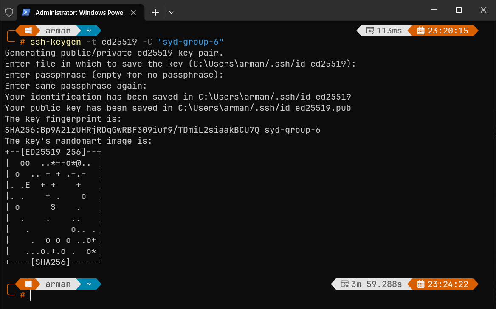

The fingerprint is `SHA256:Bp9A21zUHRjRDgGwRBF3O9iuf9/TDmiL2siaakBCU7Q`.

We chose **ed25519** over RSA: it gives security comparable to a 3072-bit RSA key in 256 bits, it is fast, and it avoids several classes of implementation mistake that have affected RSA. This is a deliberate contrast with Section 1.2 — where we could not choose the algorithm, here we could, and chose a modern one.

| File | Contents | Where it belongs |
|---|---|---|
| `id_ed25519` | **Private** key | Stays on the Windows workstation |
| `id_ed25519.pub` | **Public** key | Copied to the router |

**Installing the public key on OpenWRT.**

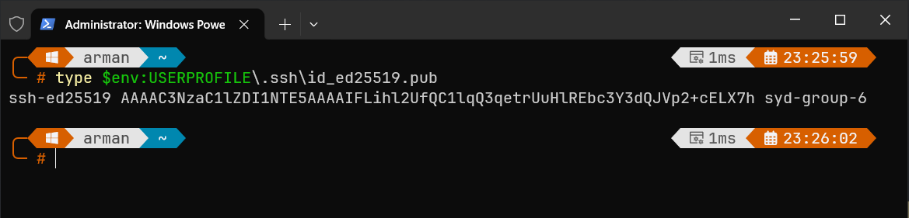

OpenWRT uses dropbear, which reads authorised keys from `/etc/dropbear/authorized_keys`:

```sh
mkdir -p /etc/dropbear
echo 'ssh-ed25519 AAAAC3NzaC1lZDI1NTE5AAAAIFLihl2UfQC1lqQ3qetrUuHlREbc3Y3dQJVp2+cELX7h syd-group-6' >> /etc/dropbear/authorized_keys
chmod 600 /etc/dropbear/authorized_keys
/etc/init.d/dropbear restart
```

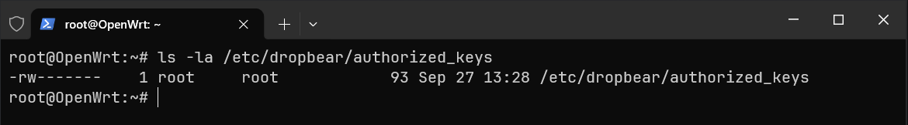

```
-rw-------    1 root     root            93 Sep 27 13:28 /etc/dropbear/authorized_keys
```

The `chmod 600` is required, not cosmetic. Dropbear refuses an `authorized_keys` file writable by anyone but its owner, because any user able to write to it could append their own key and grant themselves root access without a password.

**Demonstrating a successful key-based login.**

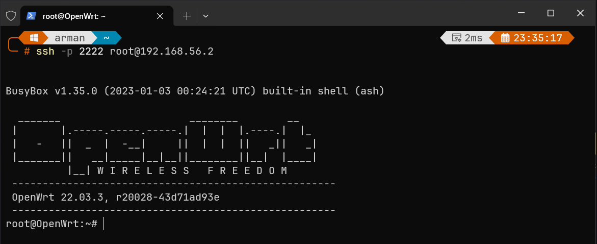

The session opens directly at the OpenWrt banner with no password prompt.

**Why key-based authentication is more secure than password-only authentication.**

The fundamental difference is that **no reusable secret is ever sent to the server, and none is stored on it.**

With a password, the client sends the actual password, the server hashes it and compares, and the server must therefore store something derived from it — the MD5-crypt hash from Section 1.2, which offers limited resistance to offline cracking.

With keys, the server sends a random challenge, the client signs it with the private key, and the server verifies the signature against the public key it holds. The private key never crosses the network, and the server holds only the public key, which is useless to an attacker. Stealing `authorized_keys` yields nothing: the private key cannot be derived from it, and a previous signature cannot be replayed because each login uses a fresh challenge.

In practice this means brute force becomes infeasible — there is no dictionary of likely keys and the keyspace is beyond exhaustive search; compromising the router yields no credentials that work elsewhere; and access is revocable per device, since removing one line from `authorized_keys` revokes one workstation without changing a shared password.

**A trade-off we made.** We created the key without a passphrase so the demonstration login is unattended. A passphrase encrypts the private key on disk, so a stolen laptop would not immediately grant router access. In a real deployment we would use a passphrase with an SSH agent, which prompts once per session rather than per connection.

**Further hardening we would recommend.** Password authentication is still enabled alongside the key. The logical next step is to disable it:

```sh
uci set dropbear.@dropbear[0].PasswordAuth='off'
uci set dropbear.@dropbear[0].RootPasswordAuth='off'
uci commit dropbear
/etc/init.d/dropbear restart
```

We documented rather than applied this, because with only one authorised key installed any problem with that key would leave no way in over the network. In production it would be applied once a second administrator key had been installed and tested.

---

### 1.4 Disable an Unnecessary Service

**The risk this addresses.** Every service running on a device is code that can contain vulnerabilities, and every service listening on the network is a way in. A service that is not needed provides no benefit but carries the same risk as one that is. Reducing the number of running services reduces the attack surface, and it is one of the cheapest hardening measures available, because there is no loss of functionality if the service genuinely is not used.

**Identifying what is running.**

```sh
ls /etc/rc.d/ | grep '^S'
```

```
S00sysfixtime   S12log      S19firewall   S50cron      S95done
S00urngd        S12rpcd     S20network    S50uhttpd    S96led
S10boot         S19dnsmasq  S35odhcpd     S80ucitrack  S98sysntpd
S10system       S19dropbear S94gpio_switch S99urandom_seed
S11sysctl
```

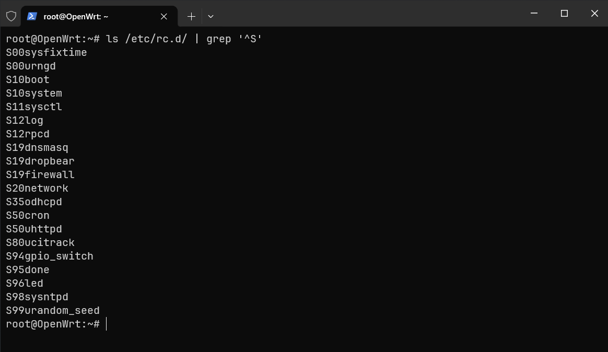

We reviewed these against what our network actually needs:

| Service | Needed? | Reason |
|---|---|---|
| `dropbear` | Yes | SSH administration (Section 1.3) |
| `uhttpd` | Yes | The business website and LuCI |
| `firewall` | Yes | All four rules in `network.md` |
| `network` | Yes | Core networking |
| `dnsmasq` | Yes | DNS and DHCP for the LAN |
| `log`, `sysntpd` | Yes | Logging, and accurate timestamps for those logs |
| `rpcd` | Yes | Required by the LuCI management interface |
| **`odhcpd`** | **No** | IPv6 DHCP and router advertisements — our network is IPv4-only |
| `gpio_switch`, `led` | No | Control physical hardware that does not exist on a VM |

**The service we disabled: `odhcpd`.** It is the clearest case of a service that is both unnecessary and network-facing. Our lab network and our production design in `network.md` are IPv4 throughout, so odhcpd provides nothing while still running as root and processing network input. The `gpio_switch` and `led` services are equally pointless on a VM, but they accept no network traffic, so removing them would not reduce exposure in the same way.

**Before — odhcpd is running and set to start at boot.**

```sh
ps w | grep odhcpd
ls /etc/rc.d/ | grep odhcpd
```

```
 1887 root      1092 S    /usr/sbin/odhcpd
K85odhcpd
S35odhcpd
```

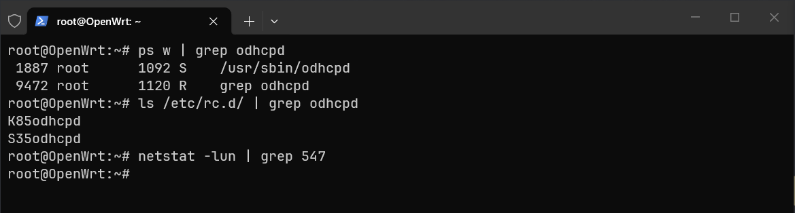

**Disabling it.**

```sh
/etc/init.d/odhcpd stop
/etc/init.d/odhcpd disable
```

Both commands are needed. `stop` terminates the running process; `disable` removes the `S35odhcpd` startup symlink so it does not return after a reboot. Using `stop` alone would appear to work until the next restart.

**After — the process is gone and it will not return.**

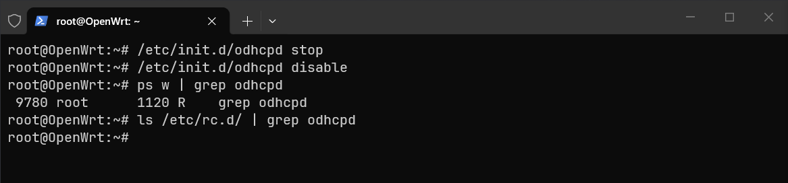

The only remaining line in `ps` is the `grep` itself, and `ls /etc/rc.d/` returns nothing for odhcpd — both symlinks removed.

**Why disabling unnecessary services improves security.** Code that is not running cannot be exploited: a future vulnerability in odhcpd would not affect this router, and there is one less component to patch and monitor.

There is a second, more specific benefit here. Router advertisements are how devices learn their IPv6 configuration, including the default gateway. On a network where IPv6 is not managed or monitored, an attacker with a foothold can use rogue router advertisements to make themselves the default IPv6 gateway and intercept traffic, while administrators watch IPv4 and see nothing wrong. Turning off unused IPv6 services removes an entire parallel network stack that nobody at the business is paying attention to.

---

## 2. Capture and Analyse Network Traffic

We captured traffic on the OpenWRT router using `tcpdump` and analysed it on the Windows host using Wireshark. Two captures were taken over the host-only network between the Windows host (192.168.56.1) and the router (192.168.56.2): one of unencrypted HTTP traffic to our business website, and one of an encrypted SSH administration session.

| File | Size | Packets | Contents |
|---|---|---|---|
| [`captures/http-capture.pcap`](captures/http-capture.pcap) | 12,612 bytes | 40 | HTTP traffic to the test website |
| [`captures/ssh-capture.pcap`](captures/ssh-capture.pcap) | 15,453 bytes | 100 | An SSH session on port 2222 |

---

### 2.1 Capture 1 — HTTP Traffic

#### Taking the capture

```sh
tcpdump -i br-mng -s 0 -w /tmp/http-capture.pcap 'tcp port 80'
```

`-i br-mng` selects the interface facing the Windows host. `-s 0` sets an unlimited snapshot length so full packets are captured rather than just headers — without it the HTML payload would be truncated and the analysis below impossible. While the capture ran we loaded `http://192.168.56.2/?v=1` from Chrome.

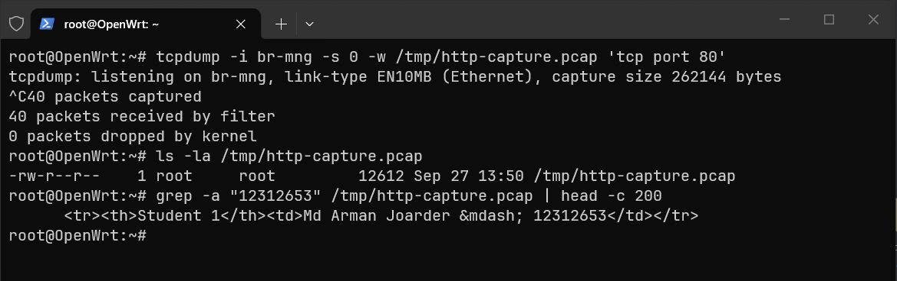

```
40 packets captured
40 packets received by filter
0 packets dropped by kernel
```

**A problem we had to solve.** Our first attempt produced a 5,475-byte file with no page content. The browser had the page cached, so it sent a conditional request and the server replied `304 Not Modified` with an empty body — the headers were captured but the HTML never crossed the network. Requesting a URL the browser had never seen, `?v=1`, forced a complete fetch; the file grew to 12,612 bytes and the content appeared.

We verified the payload before moving to Wireshark, by searching the capture file directly:

```sh
grep -a "12312653" /tmp/http-capture.pcap
```

```
<tr><th>Student 1</th><td>Md Arman Joarder &mdash; 12312653</td></tr>
```

A student ID typed into an HTML file was recoverable from the raw capture with a single text search, no analysis tool involved.

#### Analysis in Wireshark

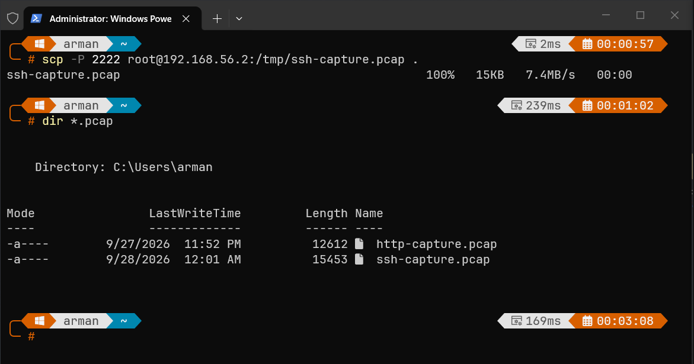

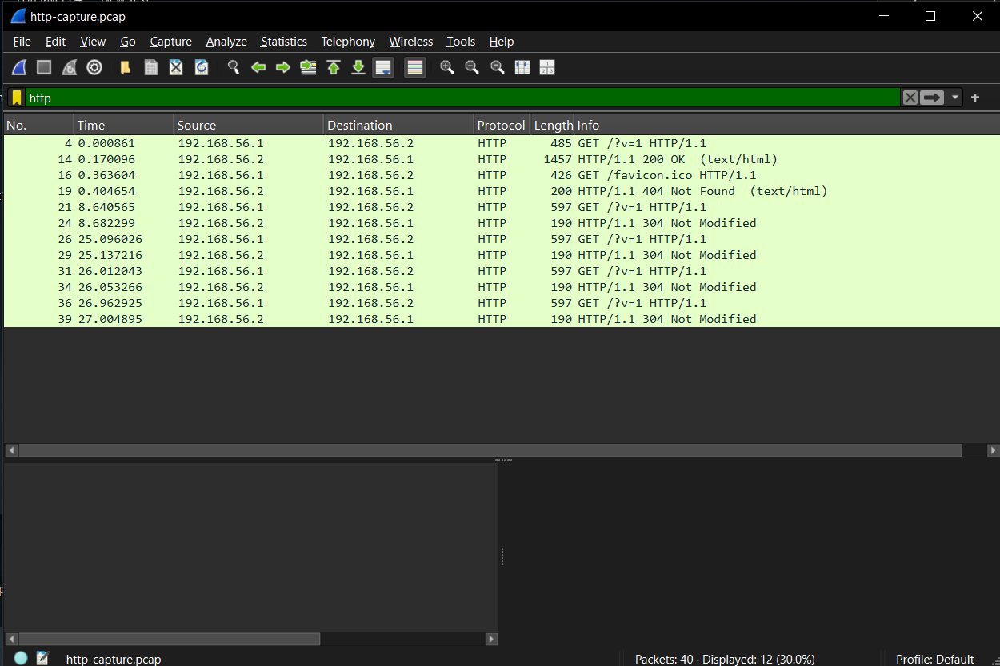

Twelve of the forty packets are HTTP; the rest are TCP handshake and acknowledgements.

| Packet | Direction | Content |
|---|---|---|
| 4 | .1 → .2 | `GET /?v=1 HTTP/1.1` |
| 14 | .2 → .1 | `HTTP/1.1 200 OK (text/html)` — the full page |
| 16 / 19 | both | `GET /favicon.ico` → `404 Not Found` |
| 21–39 | both | Later `GET`s → `304 Not Modified` |

#### The request

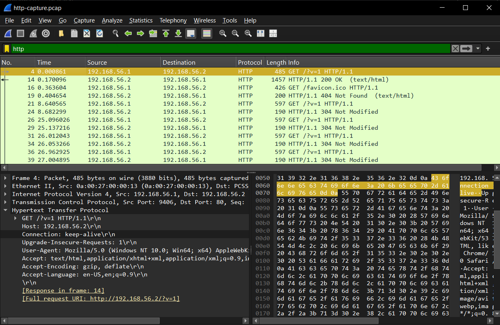

Expanding packet 4 shows the full protocol stack, and every layer leaks something:

| Layer | Field | Value |
|---|---|---|
| Ethernet | Source / destination MAC | `0a:00:27:00:00:13` → `08:00:27:e4:b4:9d` |
| IPv4 | Source / destination IP | 192.168.56.1 → 192.168.56.2 |
| TCP | Source / destination port | 9406 → 80 |
| HTTP | Request URI | `http://192.168.56.2/?v=1` |
| HTTP | Host header | `192.168.56.2` |
| HTTP | User-Agent | `Mozilla/5.0 (Windows NT 10.0; Win64; x64) ... Chrome/153.0.0.0` |

The destination MAC is the same address we identified as `br-mng` in `network.md` Section 2.2, confirming the traffic reaches the router over the host-only bridge.

#### The response

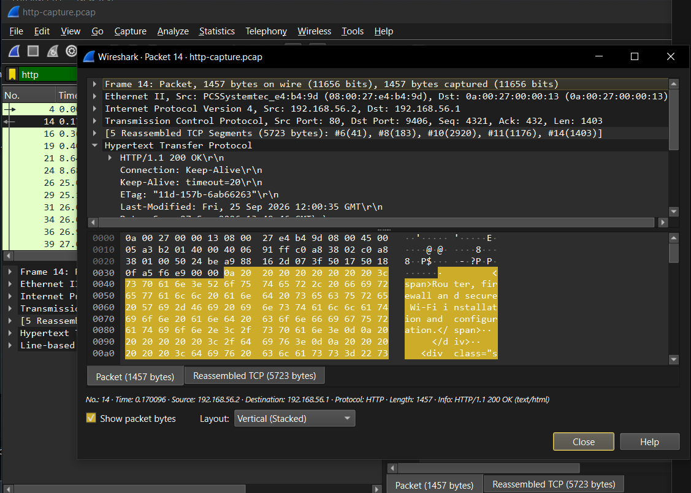

Packet 14 carries the reply. Wireshark reports `[5 Reassembled TCP Segments (5723 bytes)]` — the page was split across five TCP segments and reassembled. The headers show:

```
HTTP/1.1 200 OK
Content-Type: text/html
Content-Length: 5499
Last-Modified: Fri, 25 Sep 2026 12:00:35 GMT
```

Even in the raw hex pane the ASCII column is directly readable, with no decoding required.

#### Following the stream

Right-clicking and selecting **Follow → HTTP Stream** reassembles the whole conversation: 6 client packets, 6 server packets, 9,651 bytes.

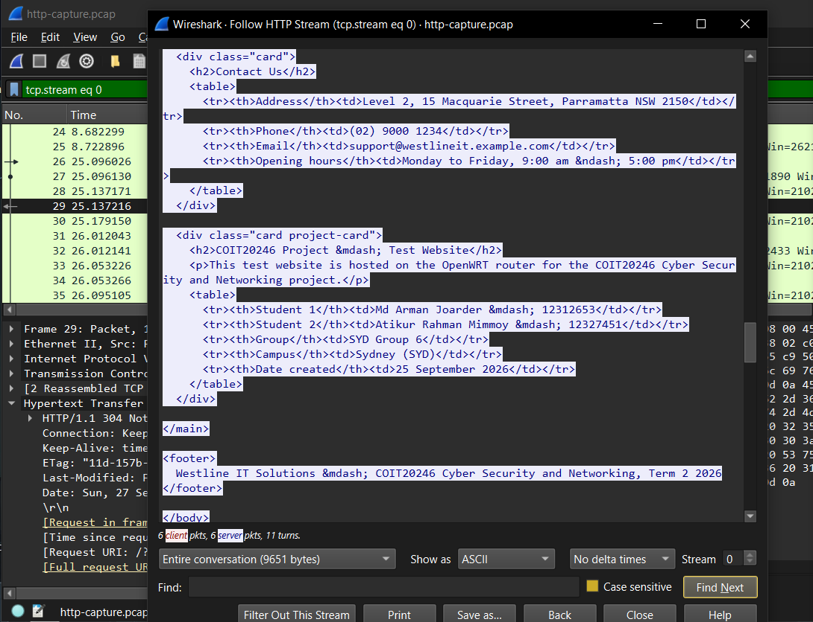

The complete page is readable, including the personalised project details:

```html
<tr><th>Student 1</th><td>Md Arman Joarder &mdash; 12312653</td></tr>
<tr><th>Student 2</th><td>Atikur Rahman Mimmoy &mdash; 12327451</td></tr>
<tr><th>Group</th><td>SYD Group 6</td></tr>
<tr><th>Date created</th><td>25 September 2026</td></tr>
```

The business contact details are equally exposed, including the address, phone number and email.

#### Security implications — what could an attacker learn?

Anyone positioned to observe this traffic obtains the following with no cracking, guessing or specialist equipment:

**The complete content of every page viewed.** Our page is public information, so the content itself is not confidential — but the principle generalises. HTTP provides no confidentiality whatsoever. If Westline later added a client portal over HTTP, every client record displayed would be exposed the same way.

**Credentials, if any were used.** Our site has no login, but had it, the username and password would appear exactly as the HTML did. The same applies to session cookies — capture one and you can impersonate that user without knowing their password.

**Who is talking to whom, and about what.** The IP and MAC addresses identify both machines, the URI shows which pages were requested, and the timing shows when.

**What software the client is running.** The User-Agent volunteers Windows 10, 64-bit, Chrome 153. An attacker can look up known vulnerabilities for that exact version rather than guessing.

**The ability to modify traffic, not just read it.** HTTP provides no integrity protection, so an attacker in the path can alter the response in transit — injecting a fake login form, adding malicious JavaScript, or changing bank details on an invoice. The browser cannot detect the change, because there is nothing to verify against.

For a business selling cyber security services, serving its public site over plain HTTP is also a credibility problem: browsers show a "Not secure" warning, visible in our own screenshots.

---

### 2.2 Capture 2 — SSH Traffic

#### Taking the capture

```sh
tcpdump -i br-mng -s 0 -w /tmp/ssh-capture.pcap 'tcp port 2222'
```

We ran this from the VirtualBox console rather than over SSH, so the capture would record only the session being studied and not the session doing the capturing. While it ran we connected from the Windows host and executed `uname -a`, `ls /etc` and `cat /etc/openwrt_release`.

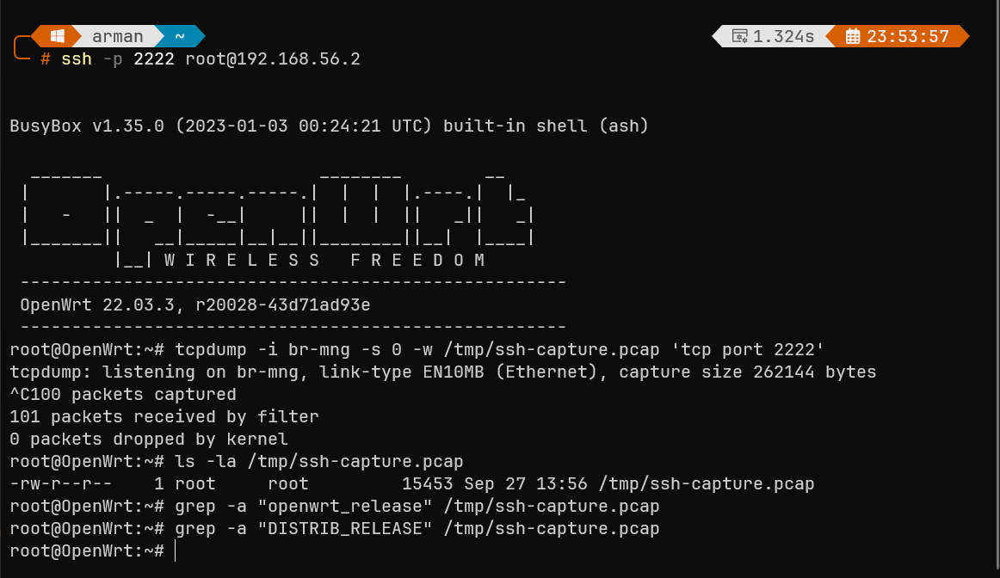

```
100 packets captured
101 packets received by filter
0 packets dropped by kernel
```

We then applied the same test we used on the HTTP capture:

```sh
grep -a "openwrt_release" /tmp/ssh-capture.pcap
grep -a "DISTRIB_RELEASE" /tmp/ssh-capture.pcap
```

Both returned nothing. We had typed `cat /etc/openwrt_release` and watched `DISTRIB_RELEASE='22.03.3'` print on screen, yet neither string appears anywhere in 15,453 bytes of captured traffic.

#### Analysis in Wireshark

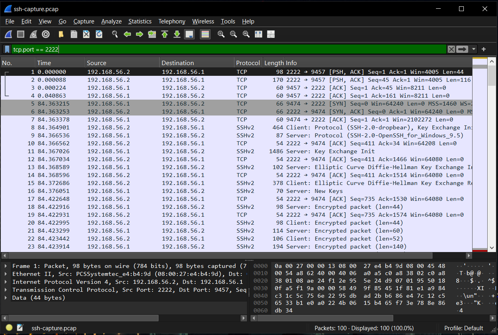

Wireshark identified the traffic as **SSHv2** despite the non-standard port, using protocol heuristics rather than the port number. The session divides into two phases:

| Packets | Phase | Readable? |
|---|---|---|
| 5–7 | TCP three-way handshake | Headers only |
| 8–9 | Version banner exchange | **Yes — plaintext** |
| 11–15 | Key Exchange Init, Elliptic Curve Diffie-Hellman | **Yes — plaintext** |
| 16 | New Keys | Changeover point |
| 18 onward | `Encrypted packet (len=…)` | **No** |

Note that Wireshark labels 192.168.56.2 as "Client" and 192.168.56.1 as "Server", the reverse of reality — 192.168.56.2 is the router running the SSH server. We refer to them by address to avoid repeating that mistake.

#### What is visible before encryption begins

```
SSH-2.0-dropbear
SSH-2.0-OpenSSH_for_Windows_9.5
```

Each side announces its software and version. The algorithm negotiation is also plaintext — the router offers:

```
kex:     curve25519-sha256, diffie-hellman-group14-sha256, diffie-hellman-group14-sha1
hostkey: ssh-ed25519, rsa-sha2-256, ssh-rsa
cipher:  chacha20-poly1305@openssh.com, aes128-ctr, aes256-ctr
mac:     hmac-sha1, hmac-sha2-256
```

The host key type in use is `ssh-ed25519`, matching the algorithm chosen in Section 1.3.

#### What is not visible

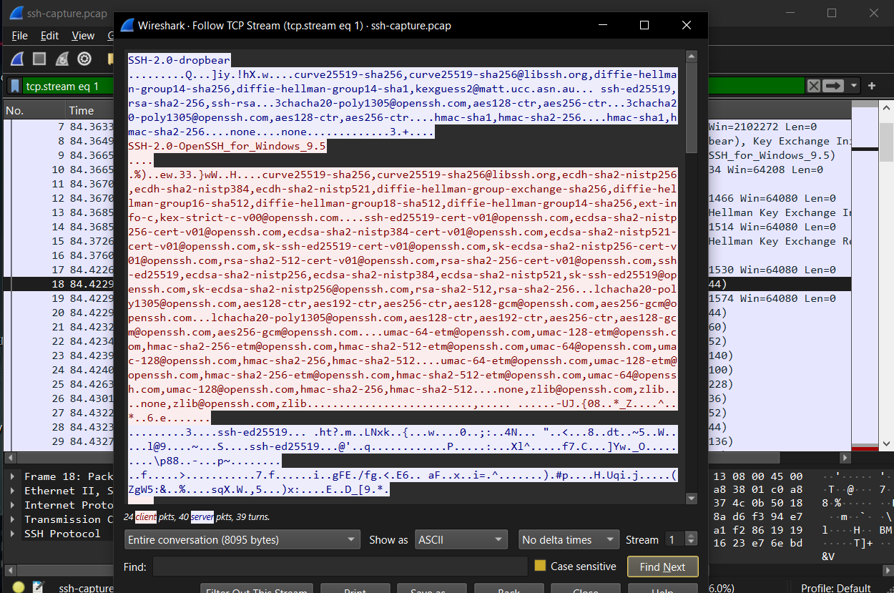

Following the TCP stream shows the two version banners as readable text, then nothing but binary data. The commands we typed, their output, the directory listing of `/etc`, and the authentication exchange itself are all unrecoverable. This is the direct counterpart to the HTTP stream in Section 2.1: same tool, same view, same network — and no readable content.

#### Comparison and why encryption matters

The two captures were taken minutes apart, on the same interface, between the same two machines, with the same tools. The only difference is the protocol.

| | HTTP (port 80) | SSH (port 2222) |
|---|---|---|
| `grep` for known content | Returned the full HTML | Returned nothing |
| Follow Stream | Complete page, readable | Two banners, then binary |
| Content confidentiality | None | Protected |
| Content integrity | None — modifiable in transit | Protected — tampering detected |
| Credentials | Would be readable | Never transmitted (key-based) |
| Software versions disclosed | Yes, via User-Agent | Yes, via version banner |
| Endpoints, ports, timing | Visible | Visible |

**Encryption protects content, not metadata.** The SSH capture still reveals that 192.168.56.1 connected to 192.168.56.2 on port 2222, at what time, for how long, and how many bytes flowed each way. Interactive SSH sends a packet per keystroke, so packet sizes and timing leak typing rhythm and command lengths even though the characters are protected.

**The negotiation phase is a real disclosure.** An attacker learns the router runs dropbear and the client OpenSSH 9.5 on Windows, and can search for vulnerabilities in those exact versions. They also learn which algorithms are supported — and here that reveals something worth acting on. The router still offers `hmac-sha1` and `diffie-hellman-group14-sha1`, both SHA-1 based and obsolete. Modern clients negotiate something stronger, but continuing to offer legacy options creates the possibility of a downgrade attack against an older or manipulated client. We would recommend restricting the offered algorithms to the modern set.

**Why this matters for the business.** Westline's systems administrator manages the router over SSH, across the same office network as everything else. Were that done over an unencrypted protocol such as telnet, an attacker with a foothold on any staff workstation could read the entire session, credentials included, and take full control of the router. Because SSH is used, and because we configured key-based authentication in Section 1.3, there is no password in the traffic to capture and no content to read.

The recommendation that follows from these two captures is straightforward: the business website should be served over HTTPS. The mechanism is the one demonstrated by the SSH capture — encrypt the channel so content is confidential and tamper-evident, rather than relying on the network being trustworthy.

---

## 3. References

OpenWrt Project. *Dropbear SSH Server Configuration*. https://openwrt.org/docs/guide-user/base-system/dropbear

OpenWrt Project. *OpenWrt Firewall Configuration*. https://openwrt.org/docs/guide-user/firewall/firewall_configuration

The Tcpdump Group. *tcpdump(8) man page*. https://www.tcpdump.org/manpages/tcpdump.1.html

Wireshark Foundation. *Wireshark User's Guide*. https://www.wireshark.org/docs/wsug_html_chunked/

Bernstein, D. J., Duif, N., Lange, T., Schwabe, P., and Yang, B.-Y. *High-speed high-security signatures* (Ed25519). https://ed25519.cr.yp.to/

COIT20246 Cyber Security and Networking, Term 2 2026, unit lecture material and lab practicals, CQUniversity.

*Generative AI (Claude) was used to help improve the wording of explanations in this report and to check command syntax. All configuration, testing, captures and screenshots are our own work, produced on the OpenWRT VM provided in this unit.*
