# Network Setup

COIT20246 Cyber Security and Networking — Term 2, 2026
SYD Group 6 — Atikur Rahman Mimmoy (12327451), Md Arman Joarder (12312653)

## 1. Assumptions

The scenario does not state every detail about the business, so we have made the following assumptions. Our network design, firewall rules and risk assessment are all based on them.

### 1.1 Location

The business is located in Sydney, New South Wales, in a leased office on Level 2 of a small commercial building in Parramatta.

We assume a single office in one location, so the business needs only one local network, one internet connection and one router/firewall, with no links to branch offices. All staff work from this office, so we do not design for remote access or VPN connections.

### 1.2 Type of Professional Services


This matters for security because of the data the business holds. As an IT services provider it stores administrative credentials, network documentation, remote access details and backup data belonging to its **client** businesses. That makes it a more attractive target than an ordinary firm of the same size: an attacker who compromises Westline gains access not to one network but potentially to every client network it administers — the same pattern seen in real supply chain attacks on managed service providers. Confidentiality of client credentials is therefore the highest priority in our risk assessment.

### 1.3 Number of Staff and Their Roles

The business has 5 staff:

| Role | Number | Network access needed |
|---|---|---|
| Owner / principal consultant | 1 | Full access to client records and systems |
| IT support technicians | 2 | Access to client systems and support tickets |
| Administrative staff | 1 | Scheduling, invoicing and general correspondence |
| Systems administrator (part-time) | 1 | Router, server and internal network administration |

This gives 5 Windows workstations on the internal network plus a shared network printer. Only the systems administrator needs to reach the router management interface, which is why we restrict management access rather than allowing it from every workstation. The administrative staff member needs no access to client credentials or client systems, which supports applying least privilege across the internal network.

### 1.4 Website Content

The website is a public information site only. It shows the business name, a description of the services offered, the office address and opening hours, and a contact phone number and email address.

It has no client logins, support ticket portal, file uploads, online payments or database, and collects no personal information. We assume clients raise support requests by phone and email.

This keeps the web server simple, since no database or user authentication is required. The site still needs protection: if it were defaced or taken offline the business would lose credibility with existing clients and appear untrustworthy to new ones. For a business selling cyber security services a visibly compromised website is especially damaging — a reputational risk rather than a data breach risk, but a serious one.

## 2. Lab Network — OpenWRT and VirtualBox

This section documents the lab network we built using the OpenWRT VM provided in this unit, running in VirtualBox on a Windows host.

### 2.1 OpenWRT Version

We confirmed the identity of the VM with `cat /etc/openwrt_release` and `uname -a`.

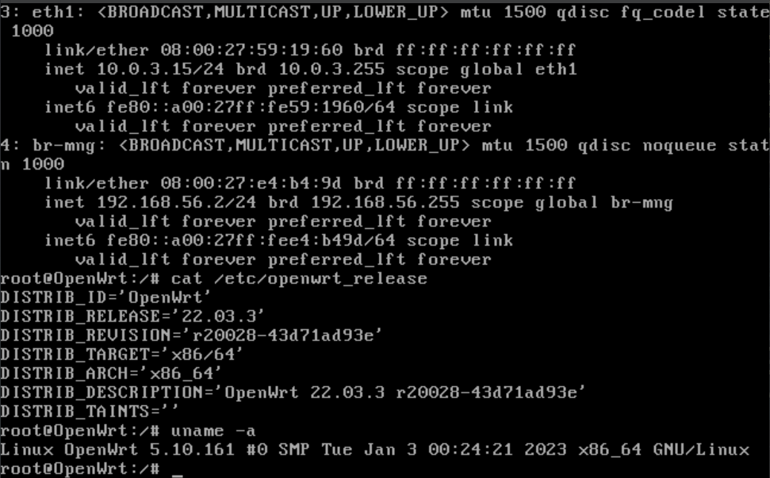

| Item | Value |
|---|---|
| Distribution | OpenWrt |
| Release | 22.03.3 |
| Revision | r20028-43d71ad93e |
| Target | x86/64 |
| Architecture | x86_64 |
| Kernel | Linux 5.10.161 #0 SMP Tue Jan 3 00:24:21 2023 x86_64 |
| Hostname | OpenWrt |

All configuration and testing in this report was carried out on this VM.

### 2.2 Interfaces and IP Addresses

We ran `ip addr` on the OpenWRT VM to list every interface and its address.

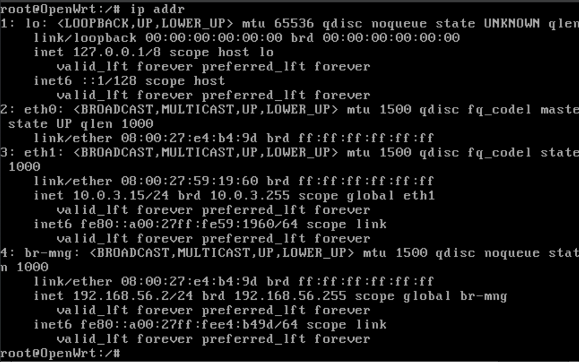

| Interface | IP address | MAC address | VirtualBox adapter | Purpose |
|---|---|---|---|---|
| `lo` | 127.0.0.1/8 | — | — | Loopback, used only within the VM |
| `eth0` | *(none)* | 08:00:27:e4:b4:9d | Host-only Adapter | The port connecting to the Windows host; no address of its own because it is a member of the `br-mng` bridge |
| `eth1` | 10.0.3.15/24 | 08:00:27:59:19:60 | NAT | The WAN side, providing outbound internet access through the Windows host |
| `br-mng` | 192.168.56.2/24 | 08:00:27:e4:b4:9d | *(bridge over eth0)* | The management bridge — the address the Windows host uses for the website, SSH, ping and the management interface |

**Why `eth0` has no IP address.** `eth0` and `br-mng` share the same MAC address, `08:00:27:e4:b4:9d`. This shows `eth0` is not an independent interface but a port bridged into `br-mng`. In a Linux bridge the member ports operate at layer 2 and carry no IP address of their own; the bridge interface holds the layer 3 address for the whole bridge. All traffic arriving on `eth0` from the Windows host is therefore handled by `br-mng` at 192.168.56.2.

**The two networks.** Each has a different job:

- **10.0.3.0/24 on `eth1` (NAT)** — outbound internet access, used for downloading packages with `opkg`. VirtualBox assigns `10.0.x.15` to NAT adapters, which identifies this as the NAT network.
- **192.168.56.0/24 on `br-mng` (Host-only)** — the internal network between OpenWRT and the Windows host. This represents the small business LAN in our design, and every test in this report is performed over it.

### 2.3 Routing

```
default via 10.0.3.2 dev eth1  src 10.0.3.15
10.0.3.0/24 dev eth1 scope link  src 10.0.3.15
192.168.56.0/24 dev br-mng scope link  src 192.168.56.2
```

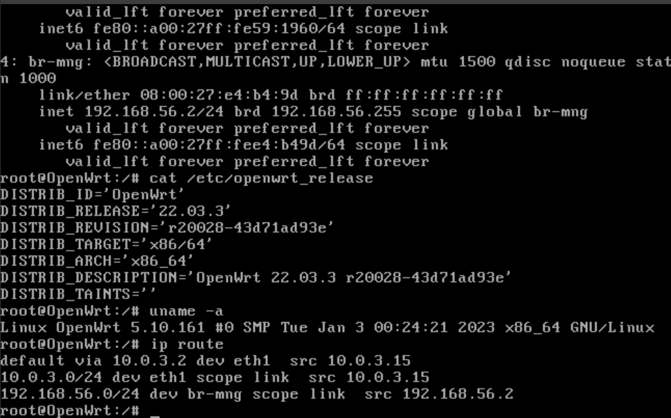

The **default route** — the path for traffic not destined for a directly connected network — goes out through `eth1` to 10.0.3.2, the VirtualBox NAT gateway, so all internet-bound traffic leaves over NAT. The 192.168.56.0/24 network is reached directly through `br-mng` with no gateway, because the Windows host is on the same subnet.

### 2.4 VirtualBox Adapter Configuration

The VM is named "COIT20246 OpenWRT T2 2023" in VirtualBox, which is the image provided in this unit. Its network settings are:

| Adapter | Attached to | Name | MAC address | OpenWRT interface |
|---|---|---|---|---|
| Adapter 1 | Host-only Adapter | VirtualBox Host-Only Ethernet Adapter | 08:00:27:E4:B4:9D | `eth0`, bridged into `br-mng` |
| Adapter 2 | NAT | — | 08:00:27:59:19:60 | `eth1` |

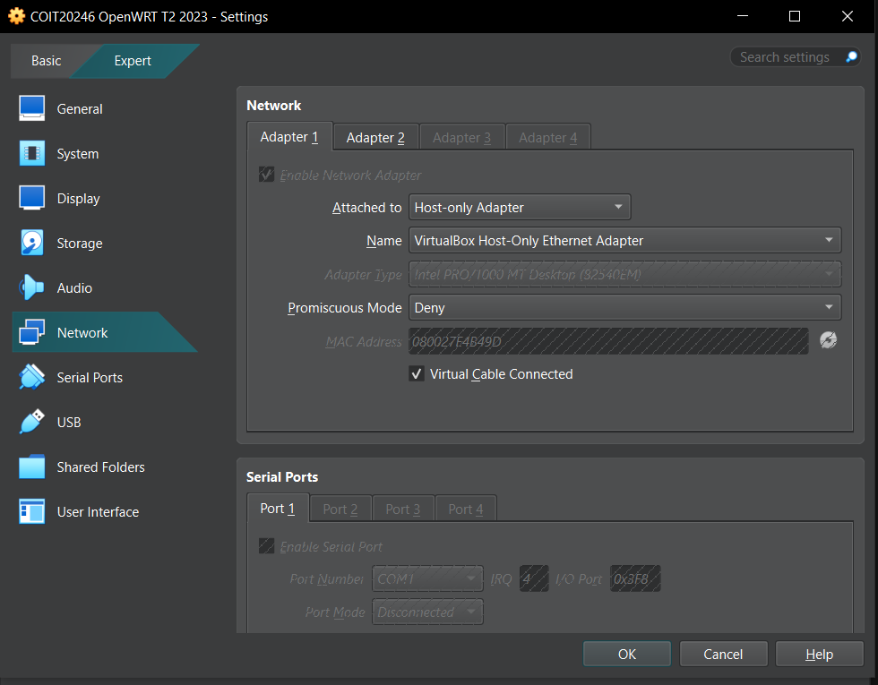

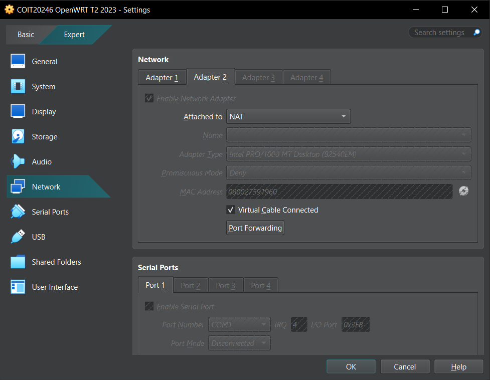

**Matching the adapters to the interfaces.** We identified which adapter corresponds to which interface by comparing MAC addresses rather than assuming an order. Adapter 1 carries MAC `080027E4B49D`, the same MAC reported by `eth0` and `br-mng` in the `ip addr` output, confirming that Adapter 1 — the host-only adapter — is presented to OpenWRT as `eth0` and bridged into `br-mng` at 192.168.56.2. Adapter 2 is therefore `eth1`, holding 10.0.3.15.

### 2.5 How the Windows Host Connects to OpenWRT

The Windows host connects over the **host-only network**, 192.168.56.0/24. VirtualBox creates a virtual adapter on the Windows host itself on this network, so the host and the VM are on the same subnet and reach each other directly. `ipconfig` shows this adapter as "Ethernet adapter Ethernet 2", holding **192.168.56.1** with a 255.255.255.0 mask and **no default gateway**. OpenWRT holds **192.168.56.2** on `br-mng`.

The absence of a default gateway confirms the network is host-only: it exists purely to connect host to VM, and Windows reaches the internet through its Wi-Fi adapter on a separate network.

NAT on `eth1` works differently. It allows OpenWRT to make outbound connections through the Windows host's connection, but the host cannot open a connection inwards across NAT, and 10.0.3.15 is not reachable from it. This is why all of our testing — the website, SSH, ping and the management interface — is carried out over the host-only network at 192.168.56.2.

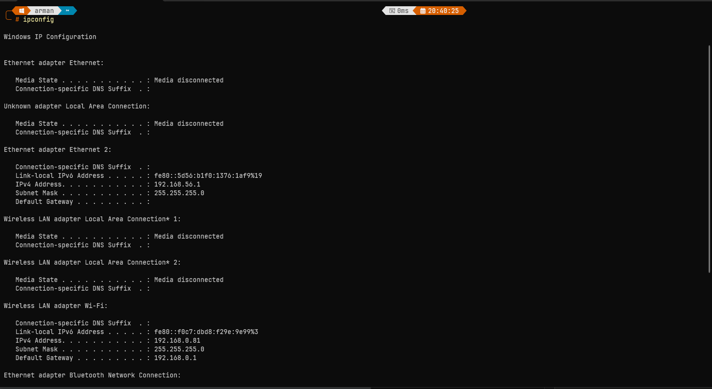

### 2.6 Lab Network Diagram

The diagram below shows our lab setup: the OpenWRT VM, the Windows host, each interface, the IP addresses and the VirtualBox adapter type used by each.

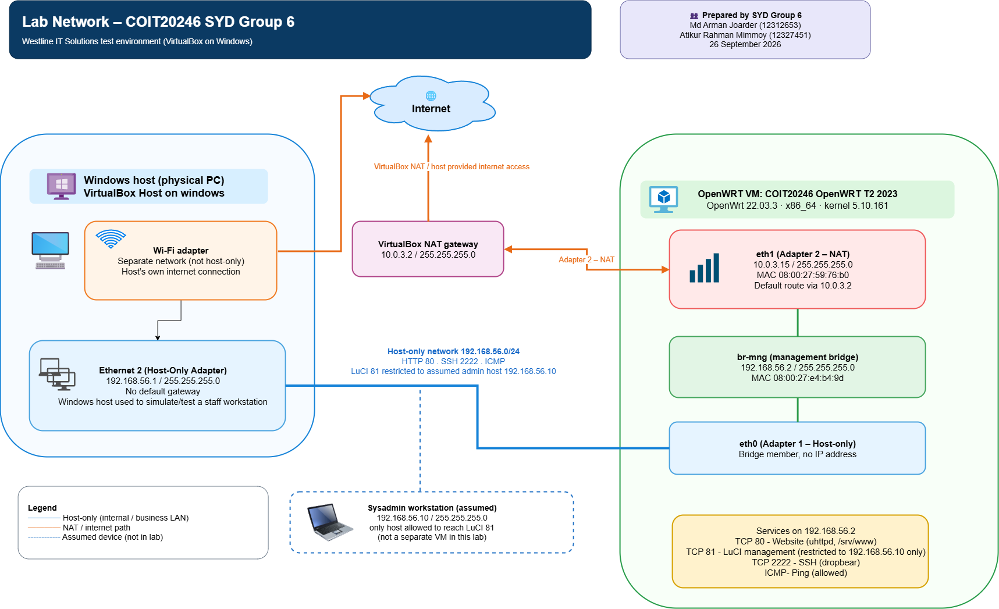

Source file: [`images/lab-network-diagram.drawio`](images/lab-network-diagram.drawio)

### 2.7 Lab IP Address Allocation

| Device | Interface | IP address | Mask | Network | Adapter type |
|---|---|---|---|---|---|
| OpenWRT VM | `eth1` | 10.0.3.15 | 255.255.255.0 | 10.0.3.0/24 | NAT |
| OpenWRT VM | `br-mng` (bridging `eth0`) | 192.168.56.2 | 255.255.255.0 | 192.168.56.0/24 | Host-only |
| OpenWRT VM | `eth0` | *(no address — bridge member)* | — | 192.168.56.0/24 | Host-only |
| Windows host | VirtualBox Host-Only Adapter ("Ethernet 2") | 192.168.56.1 | 255.255.255.0 | 192.168.56.0/24 | Host-only |
| NAT gateway (VirtualBox) | — | 10.0.3.2 | 255.255.255.0 | 10.0.3.0/24 | NAT |

## 3. Test Web Server

We set up a web server on OpenWRT to host a simple test website representing the business described in our assumptions.

### 3.1 Web Server Configuration

OpenWRT uses **uhttpd**. We examined `/etc/config/uhttpd` and found the VM runs two separate instances:

| Instance | Port | Document root | Purpose |
|---|---|---|---|
| `main` | 81 | `/www` | The LuCI management web interface |
| `student` | 80 | `/srv/www` | A separate instance for hosting our own website |

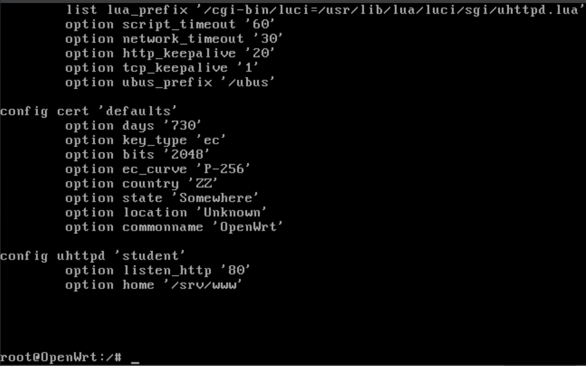

Separating the two is useful for security: the business website is served to ordinary users on port 80, while router administration sits on a different port with its own document root. Management access can therefore be restricted by the firewall without affecting the public website, which is exactly what rule 4 does in Section 4.4.

We confirmed both instances were listening with `netstat -ltn`:

```
tcp    0    0 0.0.0.0:80     0.0.0.0:*    LISTEN
tcp    0    0 0.0.0.0:81     0.0.0.0:*    LISTEN
tcp    0    0 0.0.0.0:22     0.0.0.0:*    LISTEN
```

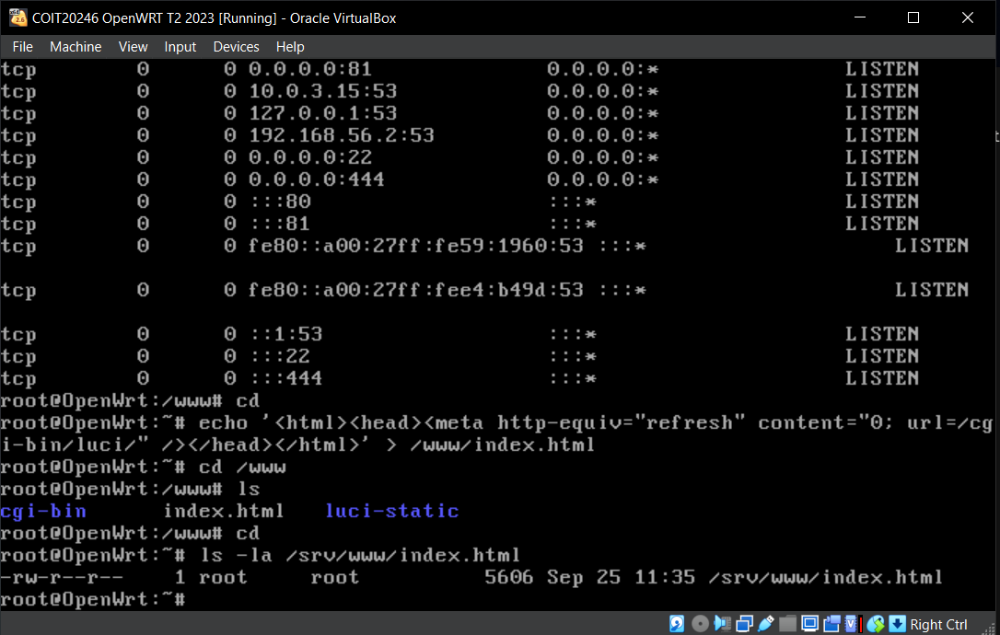

Port 80 is the website, 81 the management interface, 22 SSH — the three services our firewall rules control.

### 3.2 The Website

We wrote the website in HTML and placed it at `/srv/www/index.html`, the document root of the `student` instance. The page represents Westline IT Solutions and contains the business name, the services offered, the contact details and opening hours, and the project details including both of our full names, our student IDs, our group and the date the page was created.

The content matches the assumptions in Section 1: a public information page only, with no client login, file upload or form collecting personal data.


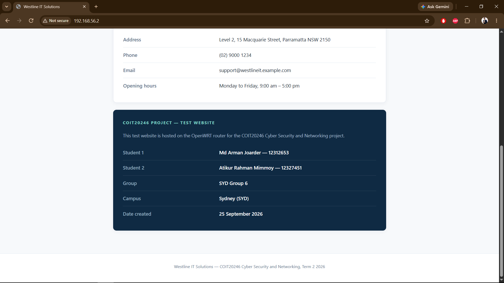

The website is reachable from the Windows host at **http://192.168.56.2/** over the host-only network.

### 3.3 Connectivity Test

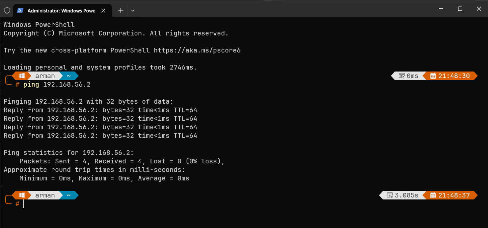

A successful reply from 192.168.56.2 shows the two machines are on the same host-only subnet and that ICMP is permitted. This is the baseline we later change in firewall rule 3, where blocking ICMP causes this same ping to fail.

## 4. Firewall Configuration

We configured and tested four firewall rules. For each we show the behaviour before the rule, the firewall configuration itself, and the behaviour after.

### 4.0 Preparation — Assigning the Management Network to a Firewall Zone

Before writing any rules we examined the existing configuration with `uci show firewall`. This revealed two problems that would have made our rules ineffective.

**The default input policy is ACCEPT.**

```
firewall.@defaults[0].input='ACCEPT'
```

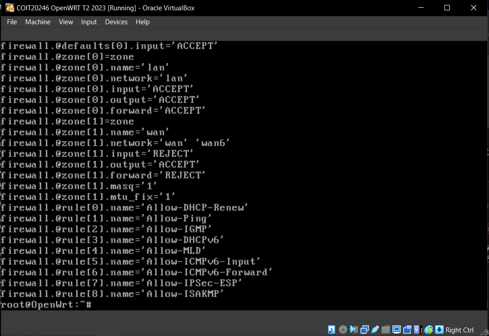

The router accepts all incoming traffic directed at itself, which is why the website, SSH and ping all worked before we configured anything. Our first job is therefore not to open services but to restrict them.

**The management network was not in any firewall zone.**

The firewall had two zones — `lan` (input ACCEPT) and `wan` (input REJECT) — but comparing against `uci show network` showed a mismatch:

```
network.mng.ipaddr = 192.168.56.2
network.mng.device = br-mng
network.lan.device = eth2
network.wan.device = eth1
```

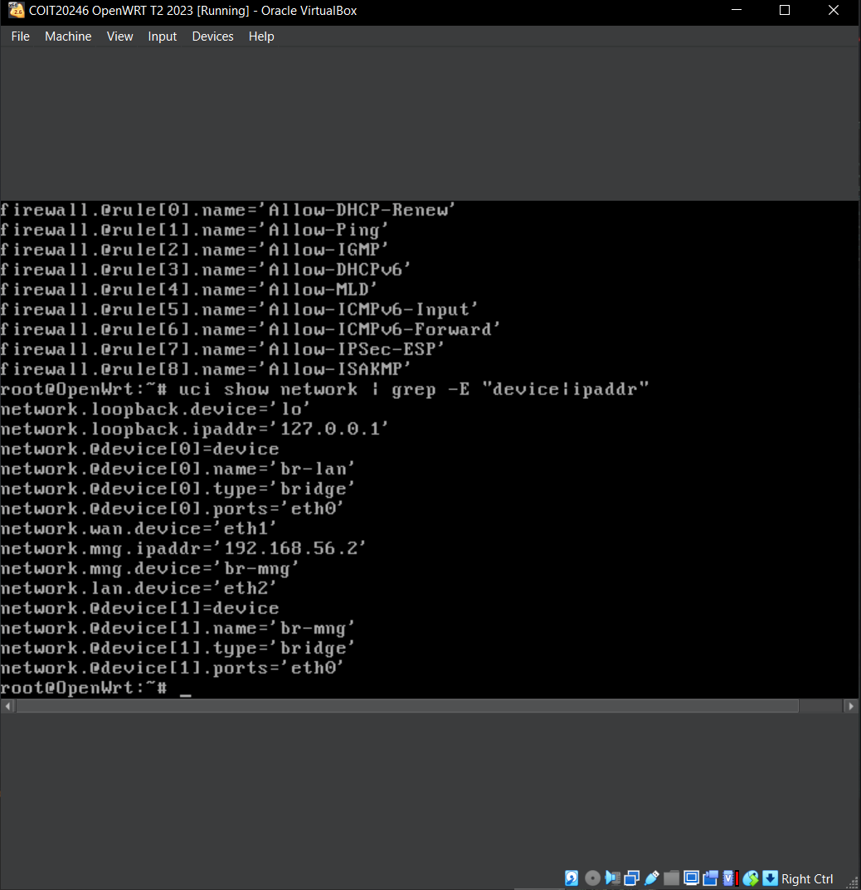

The network carrying 192.168.56.2 is named **`mng`**, not `lan`, and `lan` is configured on `eth2` — a device that does not exist on this VM. Since the `lan` zone covers only the `lan` network, `mng` belonged to no zone at all and was handled by the default ACCEPT policy.

Had we written rules using `src='lan'` they would have applied to a non-existent interface. The rules would have appeared in the configuration, the firewall would have restarted without error, and the website would have kept loading — giving the false impression the rule did not work, when it was never matching our traffic at all.

We therefore added `mng` to the `lan` zone:

```sh
uci add_list firewall.@zone[0].network='mng'
uci commit firewall
/etc/init.d/firewall restart
uci show firewall.@zone[0]
```

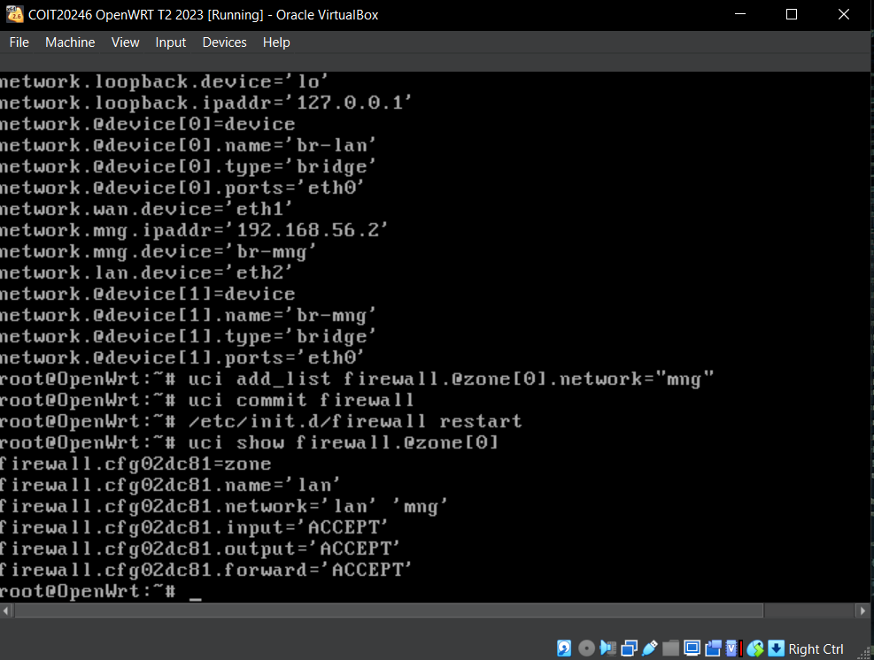

```
firewall.cfg02dc81.name='lan'
firewall.cfg02dc81.network='lan' 'mng'
firewall.cfg02dc81.input='ACCEPT'
```

This changes no behaviour on its own, since the zone's input policy is still ACCEPT. It simply means rules written with `src='lan'` now match traffic from the Windows host. All four rules below rely on it.

### 4.1 Rule 1 — Block and Allow HTTP

**Purpose.** This rule controls whether the business website on port 80 can be reached. Being able to block and restore HTTP on demand means the business can take the website offline immediately if it is defaced or found vulnerable, without shutting down the router or the rest of the network.

**Before — the website loads normally.**


**The rule.** We created a named rule so it can be modified later without depending on its position in the list:

```sh
uci set firewall.httprule=rule
uci set firewall.httprule.name='Block-HTTP'
uci set firewall.httprule.src='lan'
uci set firewall.httprule.proto='tcp'
uci set firewall.httprule.dest_port='80'
uci set firewall.httprule.target='REJECT'
uci commit firewall
/etc/init.d/firewall restart
```

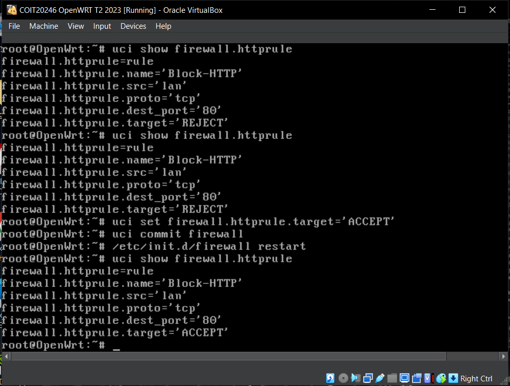

**After — the website is inaccessible.**

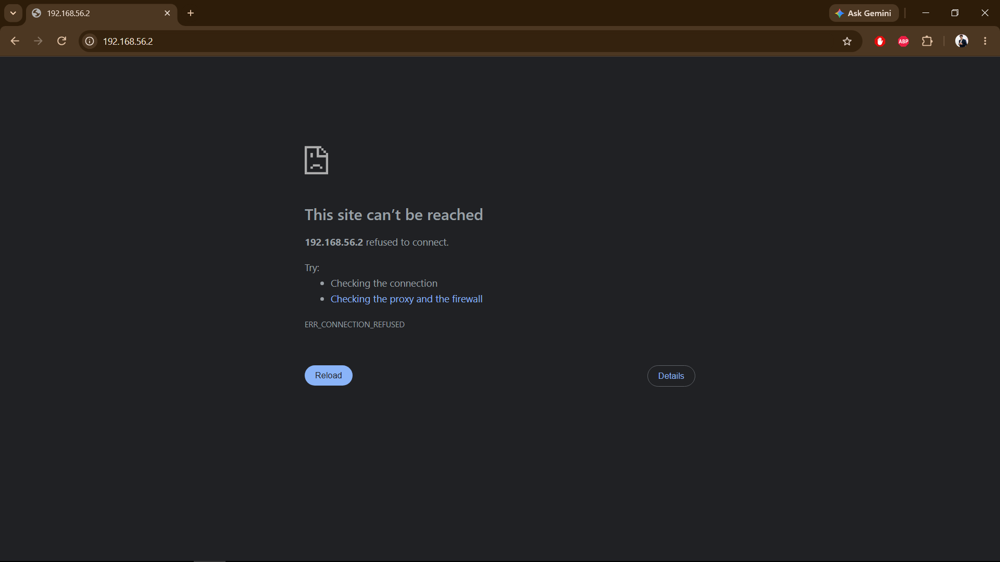

The browser returns `ERR_CONNECTION_REFUSED`. The error is *refused* rather than *timed out* because we used `REJECT` rather than `DROP`: REJECT sends an ICMP rejection back so the browser fails immediately, while DROP discards the packet silently and the browser hangs until it times out. REJECT is convenient on an internal network where fast feedback is useful; DROP is generally preferred internet-facing, because silently discarding packets gives a scanning attacker no confirmation that anything is listening.

**Changing the rule to allow HTTP.**

```sh
uci set firewall.httprule.target='ACCEPT'
uci commit firewall
/etc/init.d/firewall restart
```

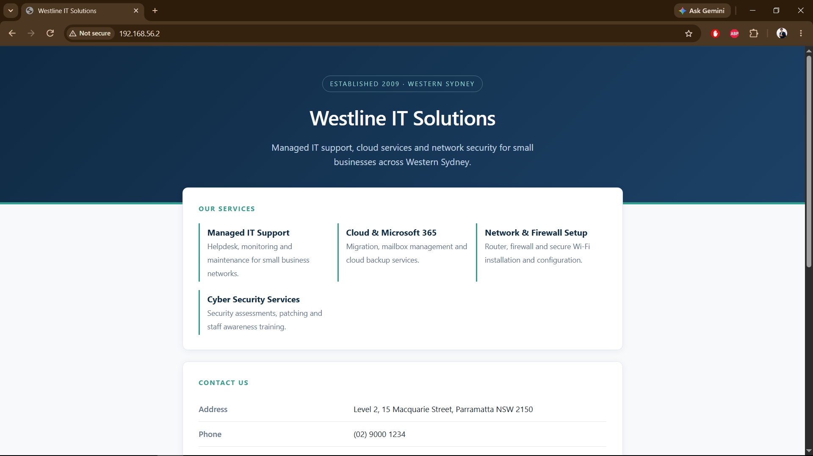

The website loads again, confirming access is controlled by this rule.

**How this contributes to network security.** The public website is the one service Westline deliberately exposes, and therefore the most likely target. Controlling it with an explicit rule makes access a deliberate decision rather than a side effect of a permissive default policy — least privilege applied at the network layer.

### 4.2 Rule 2 — Allow SSH and Change the Port

**Purpose.** SSH is how the systems administrator manages the router remotely. This rule first permits SSH explicitly on port 22, then moves the service to the non-standard port 2222 and updates the firewall to match.

**Before — SSH is reachable on port 22.**

Connecting with `ssh root@192.168.56.2` opened a session showing the OpenWrt 22.03.3 banner, confirming both that SSH worked and that we were connecting to the VM provided in this unit.

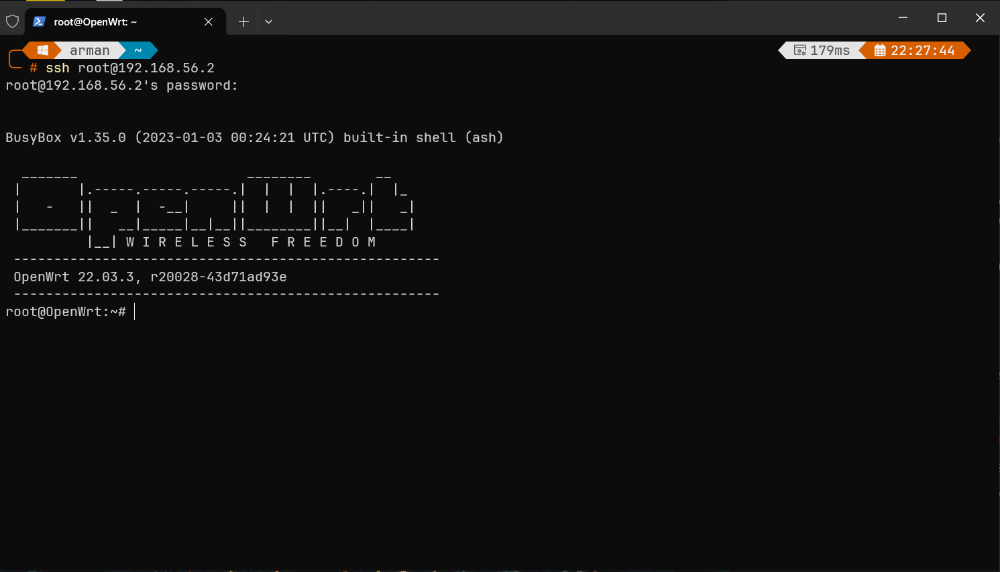

**Allowing SSH on port 22 explicitly.**

```sh
uci set firewall.sshrule=rule
uci set firewall.sshrule.name='Allow-SSH'
uci set firewall.sshrule.src='lan'
uci set firewall.sshrule.proto='tcp'
uci set firewall.sshrule.dest_port='22'
uci set firewall.sshrule.target='ACCEPT'
uci commit firewall
/etc/init.d/firewall restart
```

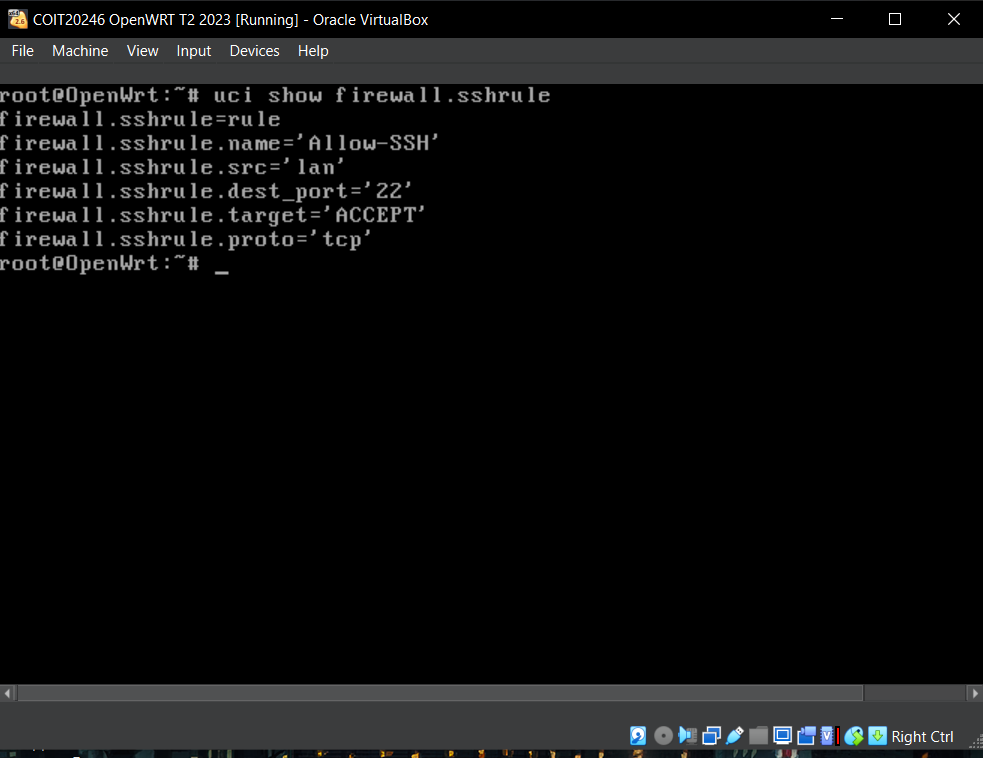

**Moving SSH to port 2222.** Two changes are needed: the service must listen on the new port, and the firewall rule must permit it.

```sh
uci set dropbear.@dropbear[0].Port='2222'
uci commit dropbear
/etc/init.d/dropbear restart

uci set firewall.sshrule.name='Allow-SSH-2222'
uci set firewall.sshrule.dest_port='2222'
uci commit firewall
/etc/init.d/firewall restart
```

`netstat -ltn` confirmed the service had actually moved:

```
tcp    0    0 0.0.0.0:2222    0.0.0.0:*    LISTEN
tcp    0    0 :::2222         :::*         LISTEN
```

Port 22 no longer appears in the listening list.

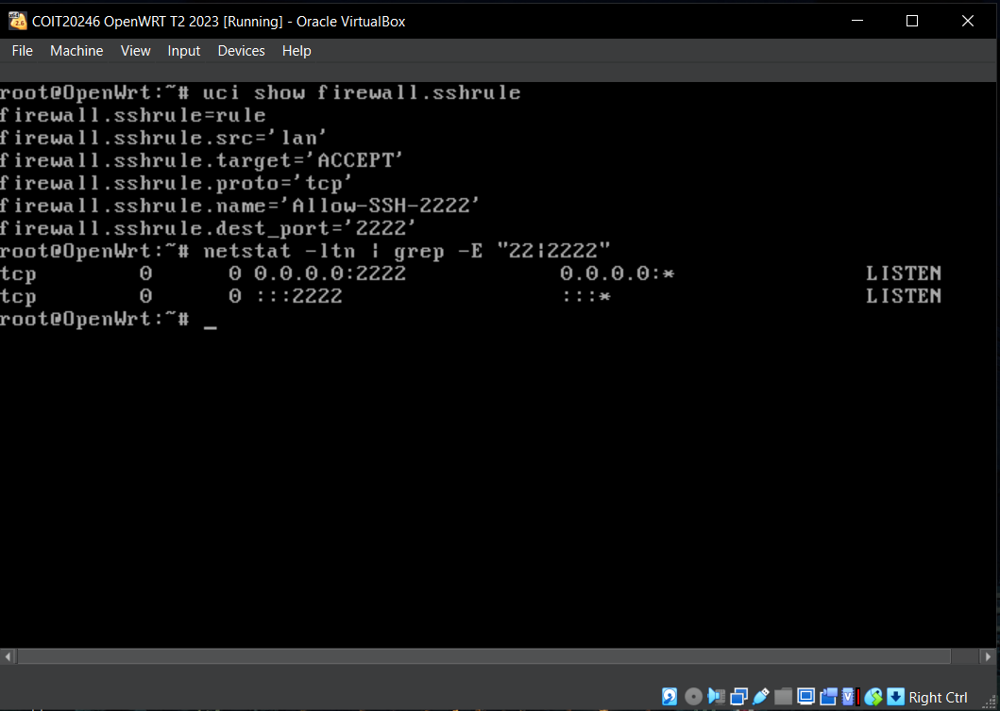

**After — port 22 is refused and port 2222 works.**

```
ssh root@192.168.56.2
ssh: connect to host 192.168.56.2 port 22: Connection refused

ssh -p 2222 root@192.168.56.2
[successful login, OpenWrt 22.03.3 banner]
```

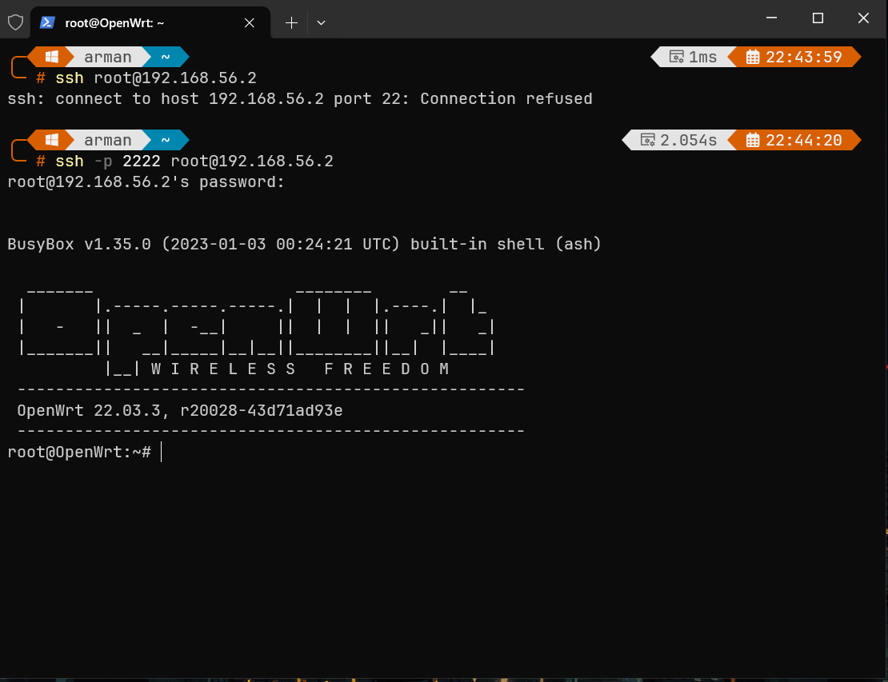

**How this contributes to network security.** Port 22 is the first port an automated scanner tries, and internet-facing SSH on port 22 receives constant brute-force attempts. Moving to 2222 removes almost all of that automated noise.

It is important to be clear about what this does not achieve. Changing the port is **security through obscurity**, not an access control: a full port scan still finds the service, and the SSH banner is visible on connection. The real benefit is practical — with the background noise gone, a login attempt in the logs is far more likely to be a real intrusion and is much easier to notice. The port change is only useful alongside a control that actually restricts access, which in our project is the SSH key-based authentication in `harden.md`. The port change reduces the volume of attacks; key-based authentication is what stops them succeeding.

### 4.3 Rule 3 — Block and Allow ICMP

**Purpose.** ICMP echo requests are what `ping` uses. This rule blocks ping responses, making the device less visible to anyone scanning the network for live hosts.

**Before — ping succeeds.**

```
Reply from 192.168.56.2: bytes=32 time<1ms TTL=64
Packets: Sent = 4, Received = 4, Lost = 0 (0% loss)
```

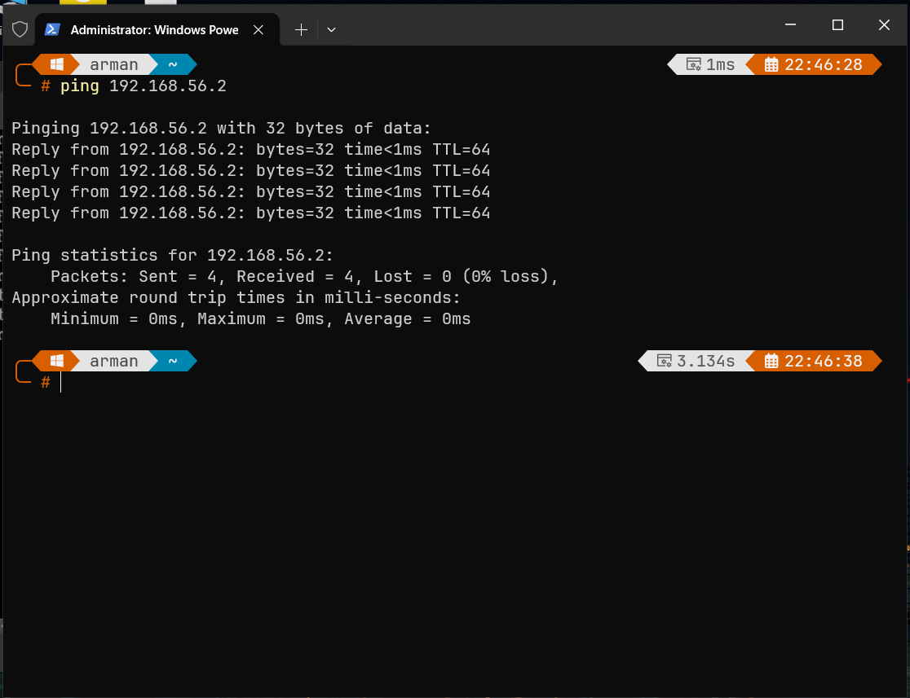

**The rule.**

```sh
uci set firewall.icmprule=rule
uci set firewall.icmprule.name='Block-ICMP'
uci set firewall.icmprule.src='lan'
uci set firewall.icmprule.proto='icmp'
uci set firewall.icmprule.icmp_type='echo-request'
uci set firewall.icmprule.family='ipv4'
uci set firewall.icmprule.target='DROP'
uci commit firewall
/etc/init.d/firewall restart
```

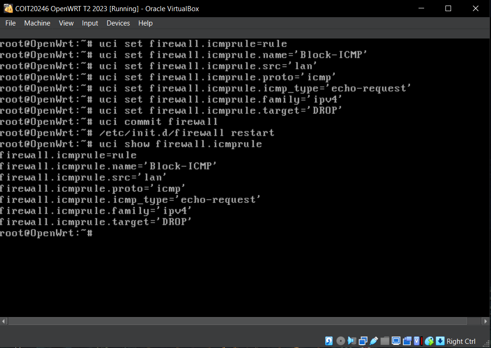

We matched specifically on `icmp_type='echo-request'` rather than blocking all ICMP. ICMP also carries essential control messages such as "destination unreachable" and "fragmentation needed"; blocking it entirely can break path MTU discovery and cause connections to hang rather than fail cleanly.

**After — ping fails.**

```
Request timed out.
Packets: Sent = 4, Received = 0, Lost = 4 (100% loss)
```

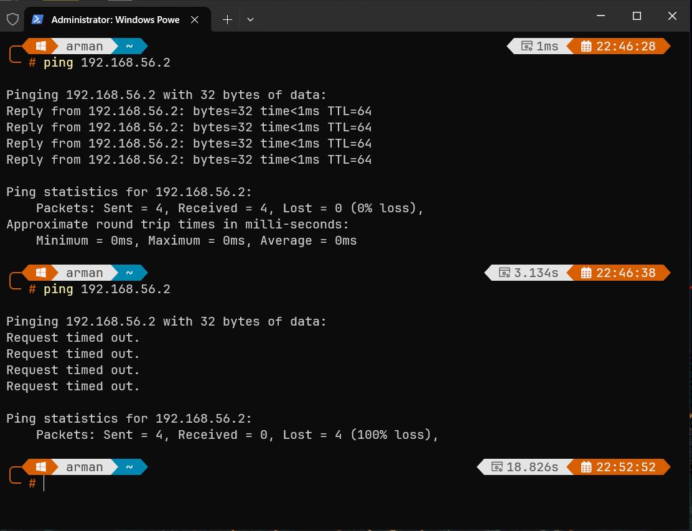

We used `DROP` here rather than the `REJECT` used in rule 1, and the difference is visible: the pings time out and the command takes roughly 19 seconds instead of 3, because each request waits for a reply that never comes. With REJECT the router would send back a rejection and the failure would be immediate — but that reply would itself confirm a host is present at that address. DROP gives no response at all, which is the whole purpose of blocking ping.

**Re-enabling ICMP.**

```sh
uci set firewall.icmprule.target='ACCEPT'
uci commit firewall
/etc/init.d/firewall restart
```

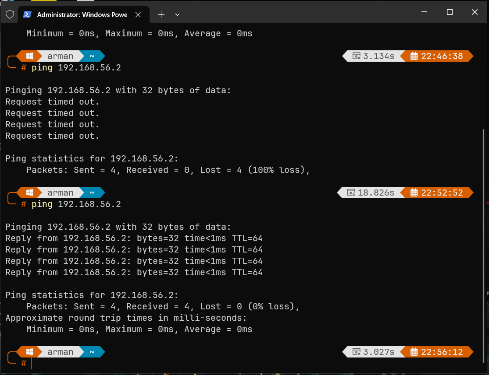

**How this contributes to network security.** Blocking ping slows the reconnaissance stage of an attack, since attackers usually begin by sweeping for hosts that respond. The protection is limited — a TCP or UDP port scan will find the router anyway, because it runs a web server and SSH — and there is a real cost: ping is the simplest diagnostic available, and blocking it makes troubleshooting harder for Westline's own administrator. Many networks therefore allow ICMP internally and block it only internet-facing.

### 4.4 Rule 4 — Restrict Management Interface Access

**Purpose.** The LuCI management interface on port 81 gives complete control of the router — firewall rules, routing, passwords and all network settings. Under our assumptions only the systems administrator needs it. Rather than blocking port 81 outright, we restricted it to the administrator's workstation.

> Before applying this rule we kept the VirtualBox console session open, so that if we lost both SSH and web access we could still reach the VM and remove the rule.

**Before — the management interface is reachable.**

Loading `http://192.168.56.2:81/cgi-bin/luci/` displayed the LuCI login page, showing that any machine on the internal network could reach the router's administration interface.

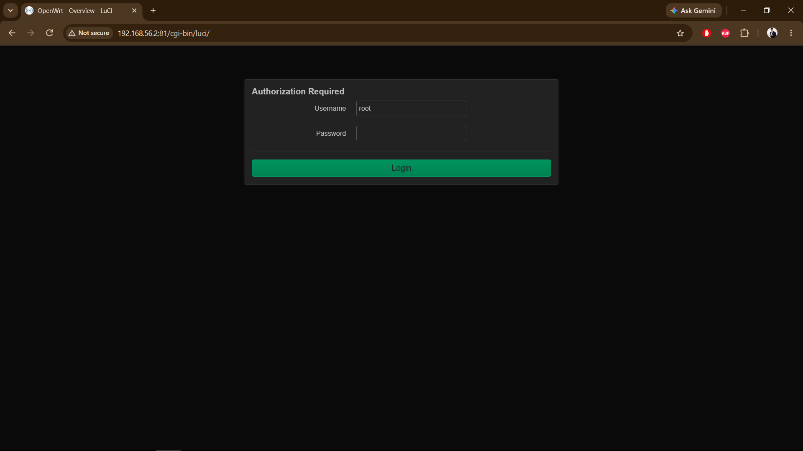

**The rules.** This needs two rules working together, and the order matters because OpenWRT evaluates them in sequence:

```sh
uci set firewall.mgmtallow=rule
uci set firewall.mgmtallow.name='Allow-Mgmt-Admin'
uci set firewall.mgmtallow.src='lan'
uci set firewall.mgmtallow.proto='tcp'
uci set firewall.mgmtallow.src_ip='192.168.56.10'
uci set firewall.mgmtallow.dest_port='81'
uci set firewall.mgmtallow.target='ACCEPT'

uci set firewall.mgmtblock=rule
uci set firewall.mgmtblock.name='Block-Mgmt-Others'
uci set firewall.mgmtblock.src='lan'
uci set firewall.mgmtblock.proto='tcp'
uci set firewall.mgmtblock.dest_port='81'
uci set firewall.mgmtblock.target='REJECT'

uci commit firewall
/etc/init.d/firewall restart
```

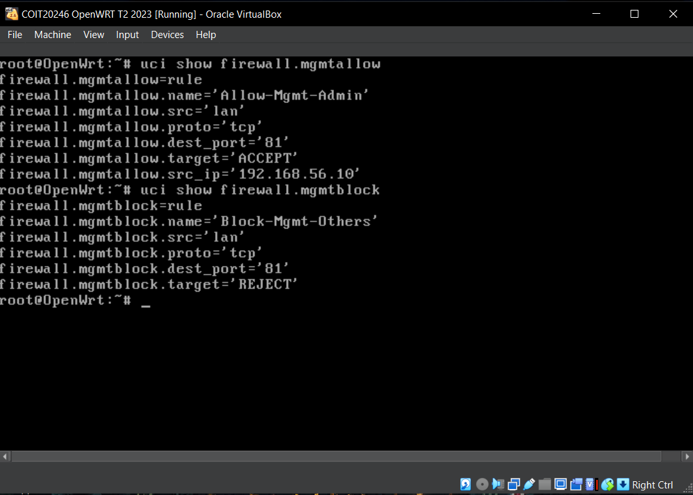

The first rule permits port 81 from 192.168.56.10, the systems administrator's workstation; the second rejects port 81 from everything else. Because the allow rule is evaluated first, the administrator's machine is permitted before the blanket rejection is reached. Reversing the order would reject every connection including the administrator's.

This is an **allow-list** approach: rather than naming the machines that are forbidden, we name the one that is permitted and refuse everything else by default, so any new workstation is denied management access automatically.

**After — access is refused.**

Our Windows host at 192.168.56.1 represents an ordinary staff workstation, not the administrator's machine. Reloading the management interface returns `ERR_CONNECTION_REFUSED`.

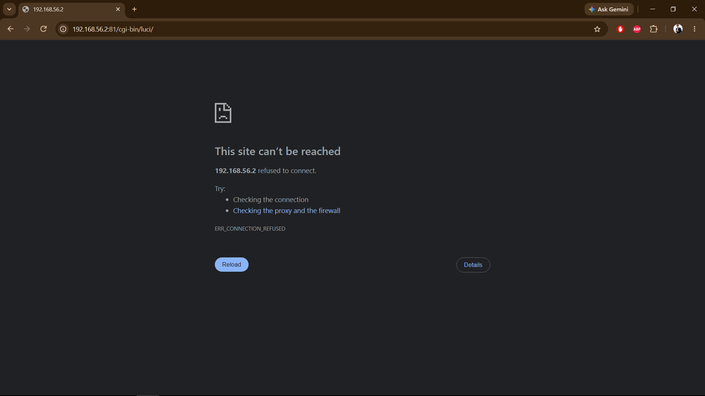

The website on port 80 continues to load throughout, confirming the restriction applies specifically to the management interface.

**How this contributes to network security.** This is the most important of the four rules for Westline IT Solutions. The company's highest-value asset is the administrative credentials it holds for client networks, and the router is the gateway through which client work is carried out.

If a staff workstation were compromised by phishing or malware — the most common entry point for a small business — the attacker would gain a foothold on the internal network. Without this rule the malware could reach the router's administration interface and attempt to brute-force the login, alter firewall rules, change DNS settings to redirect staff to fraudulent sites, or capture traffic. With the rule in place the compromised workstation cannot even establish a connection to the management port, so the foothold is contained to that single machine.

This is defence in depth: the login password protects the interface, and the firewall rule ensures most attackers never reach the login prompt at all.

## 5. Production Network Design

The lab setup in Sections 2 to 4 simulates only part of the network. This section shows how we would design the full network for the business premises described in our assumptions.

### 5.1 Design

The production network separates the business into four parts, each with its own subnet:

- **Internet connection** — a business NBN service, terminating on the router/firewall.
- **Router/firewall** — a single OpenWRT device providing routing, firewalling and NAT between the internal networks and the internet.
- **Staff network** — the workstations used by the principal consultant, the two technicians and the administrative staff member, plus a shared network printer.
- **Server network** — the web server hosting the public website, on a separate subnet from the staff workstations.
- **Management network** — the router's management interface and the systems administrator's workstation.

**Why the web server is separated.** The website is the only service deliberately exposed to the internet, which makes it the most likely component to be compromised. On its own subnet, an attacker who gains control of it is still separated by the firewall from the staff workstations where client records and credentials are held. On the staff network, compromising it would put the attacker directly alongside the business's most sensitive data.

**Why management is separated.** This applies the principle of firewall rule 4 to the production design: the router's management interface is reachable only from the management subnet, so a compromised staff workstation cannot reach it at all.

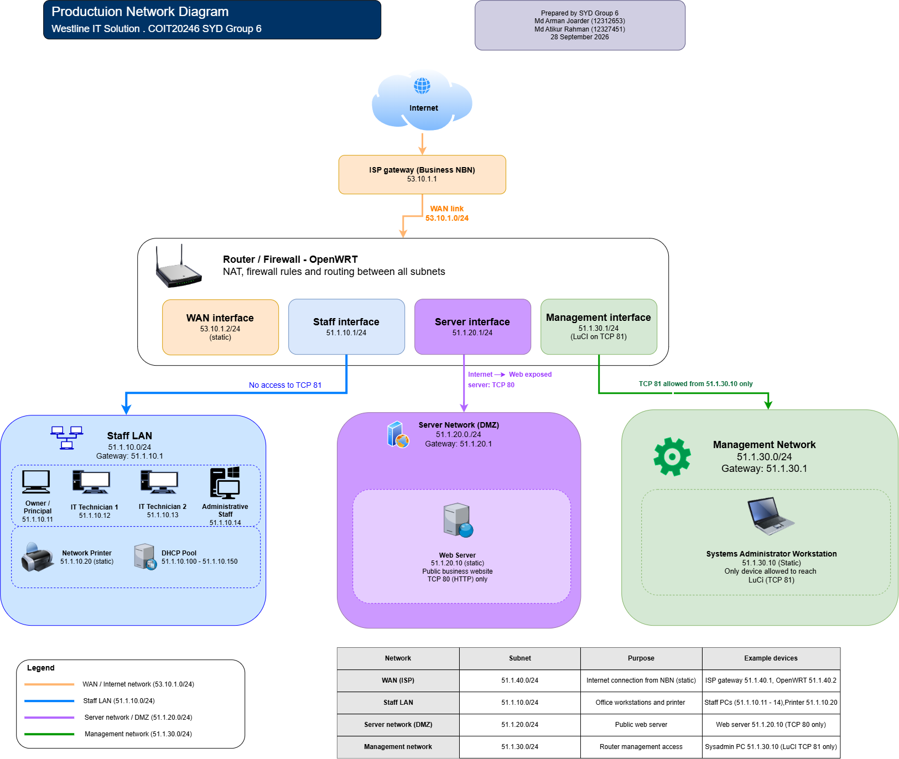

Source file: [`images/Production-Network-Diagram.drawio`](images/Production-Network-Diagram.drawio)

### 5.2 IP Addressing Requirements

The addressing follows the requirements in Section 4.1.5 of the project specification:

- Only **/16 or /24** network masks are used.
- The first octet of every address is the last two digits of a group member's student ID — **51** (from 12327451) or **53** (from 12312653).
- No private addresses such as 192.168.x.y are used anywhere in the production design.

| Network | Address range | Mask | Purpose |
|---|---|---|---|
| WAN link | 53.10.1.0/24 | 255.255.255.0 | The link between the ISP and the router/firewall |
| Staff LAN | 51.1.10.0/24 | 255.255.255.0 | Staff workstations and the network printer |
| Server network | 51.1.20.0/24 | 255.255.255.0 | The public web server |
| Management | 51.1.30.0/24 | 255.255.255.0 | Router management access |

We used /24 subnets throughout. A /24 provides 254 usable addresses, far more than a five-person business needs, but it is the smallest mask the specification permits and it keeps the addressing simple. Using separate subnets rather than one flat network is what allows the firewall to control traffic between the staff, server and management areas.

### 5.3 Address Allocation

| Device | Network | IP address | Notes |
|---|---|---|---|
| ISP gateway | WAN link | 53.10.1.1 | Provided by the ISP |
| Router/firewall — WAN interface | WAN link | 53.10.1.2 | Static address |
| Router/firewall — staff interface | Staff LAN | 51.1.10.1 | Default gateway for staff workstations |
| Owner / principal consultant | Staff LAN | 51.1.10.11 | |
| IT support technician 1 | Staff LAN | 51.1.10.12 | |
| IT support technician 2 | Staff LAN | 51.1.10.13 | |
| Administrative staff | Staff LAN | 51.1.10.14 | |
| Network printer | Staff LAN | 51.1.10.20 | Static address so it does not change |
| DHCP pool | Staff LAN | 51.1.10.100 – 51.1.10.150 | For visiting laptops and replacement machines |
| Router/firewall — server interface | Server network | 51.1.20.1 | Default gateway for the server network |
| Web server | Server network | 51.1.20.10 | Hosts the public business website on port 80 |
| Router/firewall — management interface | Management | 51.1.30.1 | Management web interface on port 81 |
| Systems administrator workstation | Management | 51.1.30.10 | The only device permitted to reach the management interface |

Fixed addresses are used for the router interfaces, the web server, the printer and the administrator's workstation, because firewall rules refer to these addresses and would stop working if they changed. The DHCP pool covers machines whose addresses do not matter to any rule.

### 5.4 How the Lab Setup Maps to the Production Design

| Production component | How it is represented in the lab |
|---|---|
| Router/firewall | The OpenWRT VM |
| Staff workstation | The Windows host at 192.168.56.1 |
| Web server | The `student` uhttpd instance on OpenWRT, port 80 |
| Management interface | The `main` uhttpd instance (LuCI), port 81 |
| Internet connection | The NAT adapter on `eth1` |
| Management network | The `br-mng` interface at 192.168.56.2 |

The lab differs in two ways, both due to available resources: the web server runs on the router rather than a separate machine on its own subnet, and the staff, server and management networks are all simulated by the single 192.168.56.0/24 host-only network, so separation is enforced by firewall rules on ports rather than by separate subnets. The rules in Section 4 demonstrate the same access controls the production design would apply between subnets.

## 6. References

OpenWrt Project. *OpenWrt Firewall Configuration /etc/config/firewall*. https://openwrt.org/docs/guide-user/firewall/firewall_configuration

OpenWrt Project. *uhttpd Web Server Configuration*. https://openwrt.org/docs/guide-user/services/webserver/uhttpd

OpenWrt Project. *Dropbear SSH Server Configuration*. https://openwrt.org/docs/guide-user/base-system/dropbear

Oracle. *Oracle VM VirtualBox User Manual — Virtual Networking*. https://www.virtualbox.org/manual/ch06.html

COIT20246 Cyber Security and Networking, Term 2 2026, unit lecture material and lab practicals, CQUniversity.

*Generative AI (Claude) was used to help improve the wording of explanations in this report and to check our firewall rule syntax. All configuration, testing, screenshots and diagrams are our own work, produced on the OpenWRT VM provided in this unit.*
