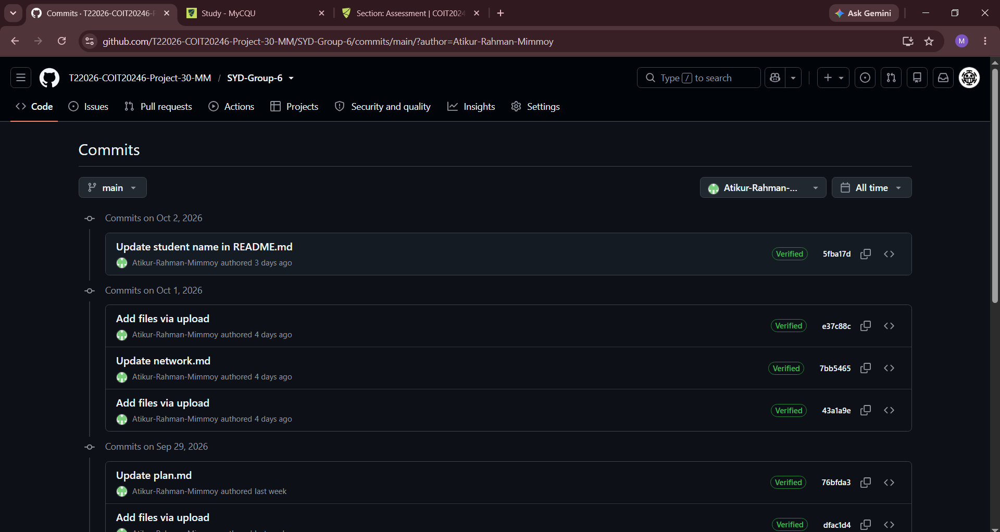
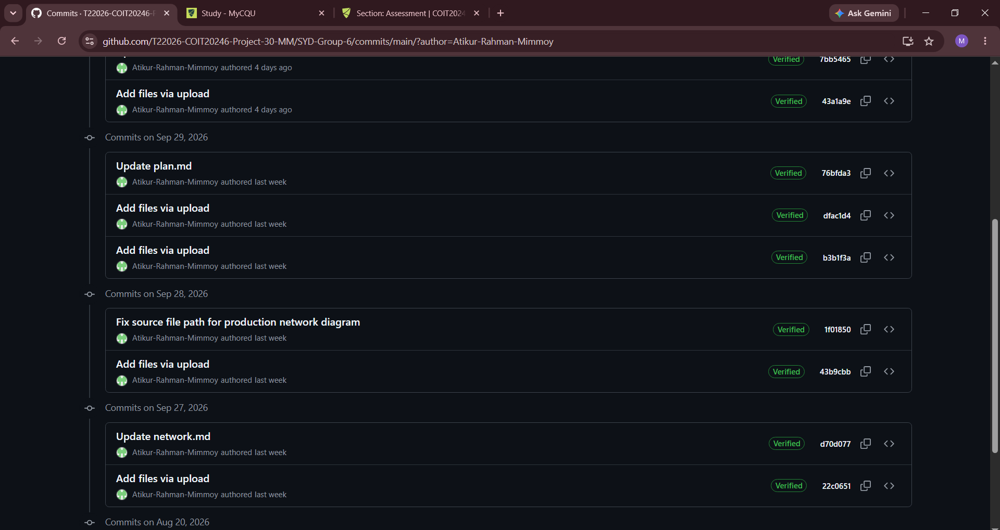
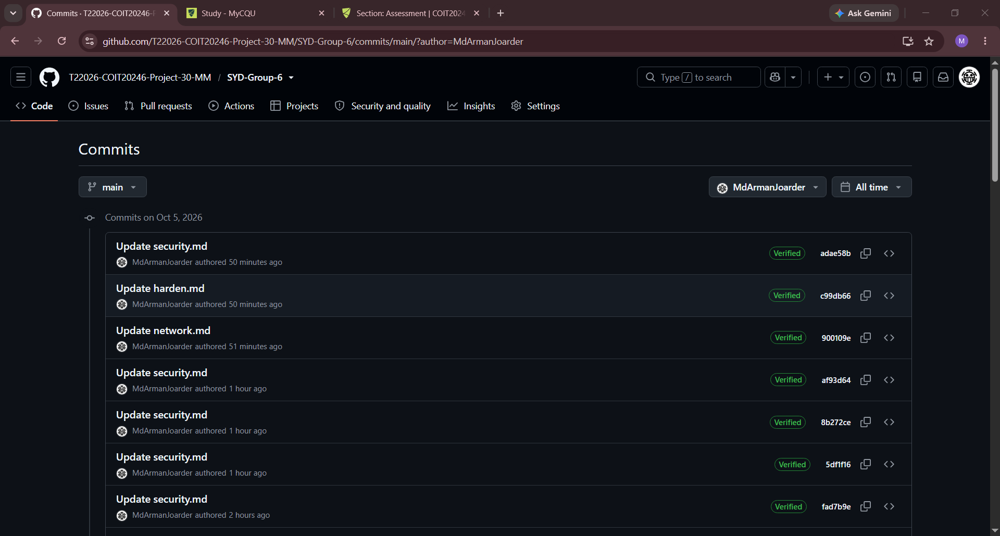
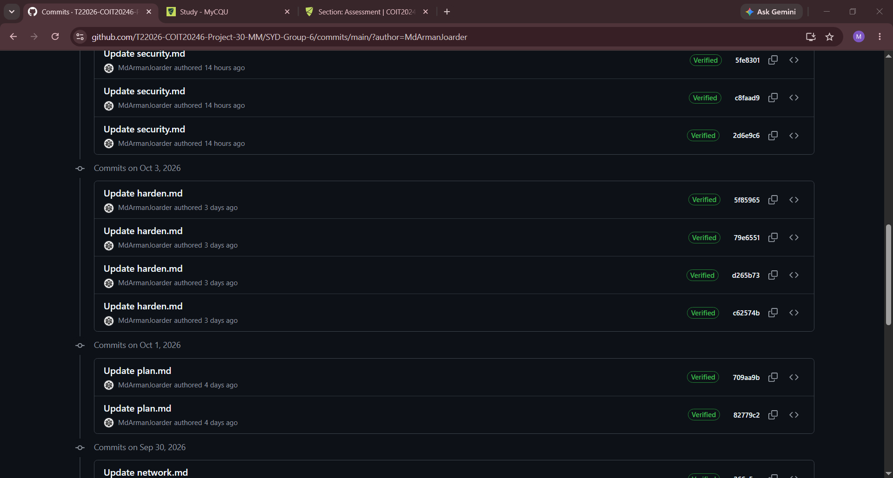

# Project Reflection

COIT20246 Cyber Security and Networking — Term 2, 2026
SYD Group 6 — Md Arman Joarder (12312653), Md Atikur Rahman (12327451)

## 1. GitHub Commits

The screenshots below show the commit history for each group member, taken from the repository's commit list filtered by author.

### Md Atikur Rahman (12327451)

### Md Arman Joarder (12312653)

Both histories begin in week 5, pause through weeks 6 to 8, and resume from week 9 onward, with most of the project work falling in the final three weeks.

## 2. List of Tasks

The table below compares the allocation we agreed in `plan.md` at the start of the project with what each of us actually did.

| Task | Planned (`plan.md`) | Actually done by |
|---|---|---|
| Repository setup, specification review, project plan | Both | Both |
| Assumptions (`network.md` §1) | Arman | Arman |
| OpenWRT interfaces, IP addresses, adapter types (§2) | Atikur | Arman |
| Lab network diagram | Atikur | **Atikur** |
| Test web server (§3) | Arman | Arman |
| Firewall rule 1 — HTTP | Arman | Arman |
| Firewall rule 2 — SSH and port change | Atikur | Arman |
| Firewall rule 3 — ICMP | Arman | Arman |
| Firewall rule 4 — management interface | Atikur | Arman |
| Production network diagram | Arman | **Atikur** |
| Hardening — root password and `/etc/shadow` | Atikur | Arman |
| Hardening — SSH keys and disabling services | Arman | Arman |
| HTTP capture and analysis | Arman | Arman |
| SSH capture and analysis | Atikur | Arman |
| Risk assessment spreadsheet | Atikur | Arman |
| Security controls (`security.md` §2) | Arman | Arman |
| Video recording | Both | Both |
| Reflection and submission | Both | Both |

In summary, Atikur produced both network diagrams — the lab diagram in `network.md` Section 2.6 and the production diagram in Section 5.1 — working from drafts we discussed together, and revised them when we checked the addressing against the report. Arman completed the lab configuration, all four firewall rules, the four hardening steps, both packet captures and their analysis, the risk assessment spreadsheet and the security controls, and wrote the report sections covering that work.

The difference between the two columns is substantial. Our plan divided the practical tasks roughly evenly, giving Atikur the network documentation, two of the firewall rules, the password hardening, the SSH capture and the risk assessment. In practice almost all of the hands-on configuration work was done by Arman, and Atikur's contribution was concentrated on the two diagrams.

## 3. Reflection on Commits and Tasks

Our two commit histories differ in both volume and shape, and the screenshots in Section 1 show the difference clearly.

Arman's commits are spread across the whole project period, from August through to October, and follow the work as it was done — the firewall configuration, the hardening steps, the packet captures, the risk assessment spreadsheet and the report sections documenting each of them. Atikur's fall into two distinct bursts: the uploads and revisions of the two network diagrams in late September, and then a large number of small edits to the report files made within a single day in October.

That second burst is worth commenting on, because it illustrates the central weakness of using commit counts as a measure of contribution. A commit count records how many times someone pushed, not how much work each push contained. Thirty or more separate edits to one file in one afternoon produce a high count while representing far less work than a single commit that adds an entire section. Counted naively, the two histories look closer in size than the work behind them actually was.

Two further things affect the numbers in the same direction. The lab work was carried out on a single machine running the OpenWRT VM, so whoever was at the keyboard was also the person committing the screenshots and configuration output from that session. And screenshots were often uploaded in batches, where one "Add files via upload" commit might carry a dozen images covering a whole section, while a one-line edit to a paragraph counts for exactly the same.

A commit count also says nothing about work that produces no file at all — reading the specification, discussing the design, or checking each other's sections. For all of these reasons we would not claim the commit totals are proportional to the actual contributions. The task table in Section 2 is the more accurate record of what each of us did, and we would treat the commit history as supporting evidence for it rather than as a measure in its own right.

## 4. Weeks in Which Commits Were Made

| Term week | Dates | Commits | Who committed |
|---|---|---|---|
| 5 | 17–23 Aug | 2 | **Both** |
| 6 | 24–30 Aug | 0 | — |
| 7 | 31 Aug – 6 Sep | 0 | — |
| 8 | 7–13 Sep | 0 | — |
| 9 | 14–20 Sep | 3 | Arman |
| 10 | 21–27 Sep | 8 | **Both** |
| 11 | 28 Sep – 4 Oct | 30 | **Both** |
| 12 | 5 Oct – | 49 | **Both** |

**Both group members made commits in 4 of the 8 weeks.**

This was not sufficient. The specification states that at a minimum we should commit once for each day we work on the project, and that each student should be making multiple commits per week. We met that standard only in the final weeks of the project.

The gap in weeks 6 to 8 has a straightforward explanation. The unit's weekly journal is a separate assessment with its own repository, and during those weeks our effort went into the journal rather than the project. We continued to meet on campus each week as planned, but the work produced in those meetings was committed to the journal repository, so nothing appears here for that period. We only began committing project work consistently once the journal was up to date.

The consequence is visible in the distribution: the large majority of our commits fall in the last two weeks of the project rather than being spread across the schedule. Our schedule in `plan.md` allocated specific tasks to weeks 5 through 11, and in practice most of those tasks were completed in weeks 10 to 12. The schedule itself was reasonable; we simply did not start against it early enough.

## 5. Reflection on Group Work

### What worked well

The communication plan held up. We agreed in `plan.md` to meet twice a week on campus, on the Thursday and Friday we both had class, and those meetings ran every week of the project. Because we were both already on campus, neither of us had to make a special trip, which is the main reason the meetings did not quietly stop happening. Booking a group study room in the library meant we could run the OpenWRT VM on one screen and look at the configuration together, which made it much faster to work through problems than describing them over a chat message would have been.

Working side by side at the VM also meant that when something did not behave as expected, both of us saw it happen rather than one of us reporting it afterwards.

### Issues we encountered

**The practical work became concentrated with one member.** This is the clearest issue, and Section 2 shows it most directly. We divided the tasks on paper in week 5, but once we were working at a single machine it was easier for whoever was configuring the VM to keep going than to hand over. Over the project this compounded, and by the final weeks the split bore little resemblance to the plan.

**We lost three weeks to another assessment.** As described in Section 4, weeks 6 to 8 produced no project commits because our attention was on the weekly journal. Nothing went wrong in those weeks — we simply were not working on this. It meant the remaining tasks had to be compressed into a much shorter period than the schedule intended.

**A firewall misconfiguration that would have been invisible.** When we examined the existing firewall configuration before writing any rules, we found that the network carrying our host-only address, `mng`, was not assigned to any firewall zone, and that the `lan` zone pointed at `eth2` — a device that does not exist on this VM. Had we not checked, every rule we wrote with `src='lan'` would have been applied to a non-existent interface. The rules would have appeared in the configuration, the firewall would have restarted without error, and the website would have kept loading. We would have concluded the rules did not work, when in fact they were never matching our traffic. This is documented in `network.md` Section 4.0.

**A packet capture that contained nothing.** Our first HTTP capture produced a 5,475-byte file with no page content in it at all. The browser had the page cached, so it sent a conditional request and the server replied `304 Not Modified` with an empty body — the headers crossed the network but the HTML never did. We diagnosed it by searching the capture file directly for our student ID and finding nothing, then forced a complete fetch by requesting a URL the browser had not seen before. This is documented in `harden.md` Section 2.1.

### Techniques we would recommend for future group projects

**Each member commits their own work on the day they do it.** Our plan said we would do this and we did not, which is why the commit history now needs explaining rather than speaking for itself. Committing daily would have produced a record that accurately showed who did what while the project was running — which matters both for marking and for noticing an uneven split early enough to correct it, rather than discovering it at the end.

**Hand over the keyboard deliberately.** The concentration of work happened because it was always easier to continue than to swap. Agreeing in advance that each person configures and commits specific tasks themselves — even when the other could do it faster — would have kept the split closer to the plan. The cost is a slower session; the benefit is that both members can actually explain the configuration afterwards.

**Keep a minimum weekly commitment to the project even when another assessment is due.** Our three-week gap happened because the journal was more immediately urgent. Agreeing a floor — one task and one commit each per week regardless of what else is due — would have prevented the work bunching into the final fortnight.

**Verify configuration against the system's actual state before testing it.** The firewall zone problem was only found because we ran `uci show firewall` and compared it against `uci show network` before writing any rules. Checking what the system is really doing, rather than assuming the configuration matches the documentation, is the single most useful habit we took from this project — and it would have saved us time on the capture problem too.

**Cross-check derived work against its source.** Our two network diagrams went through several rounds of correction because the addresses on them did not match the addressing table in `network.md`. Checking each diagram against the written section it illustrates, as a deliberate step rather than at the end, would have caught those in one pass instead of three.
