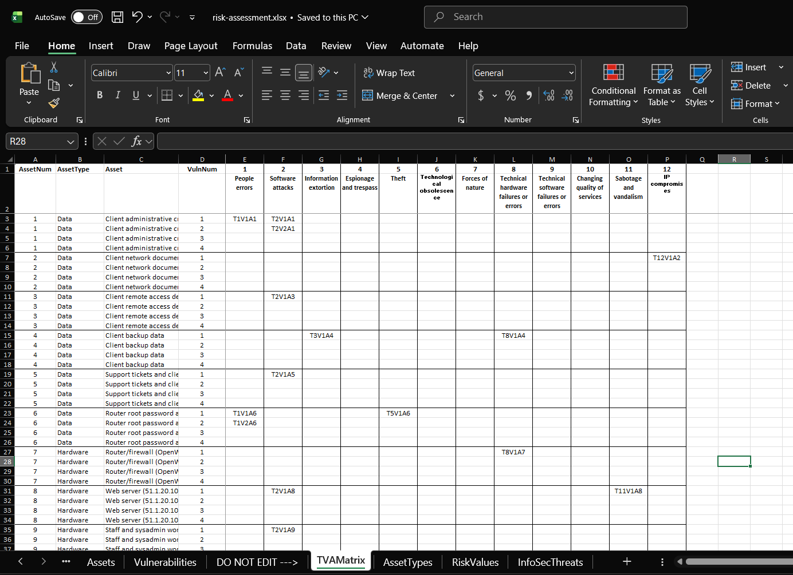
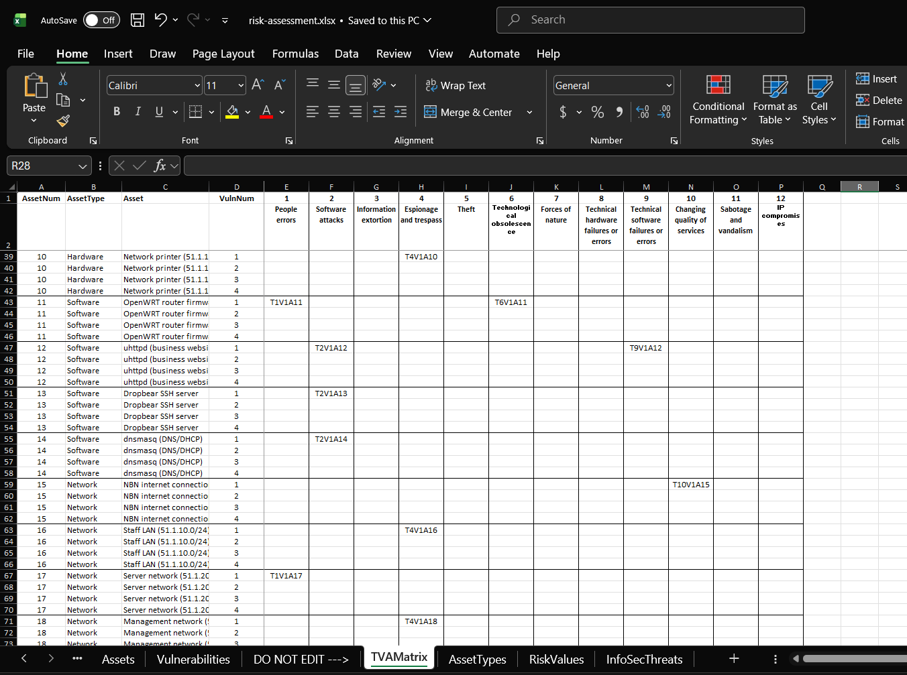
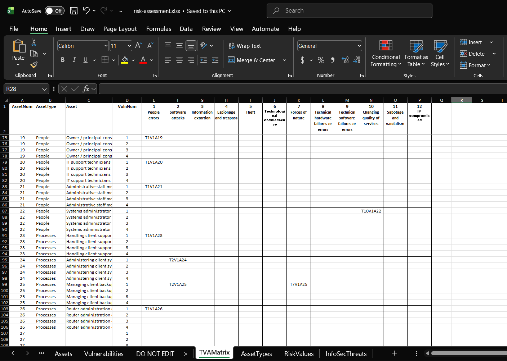

# Risk Assessment and Security Controls

COIT20246 Cyber Security and Networking — Term 2, 2026
SYD Group 6 — Md Arman Joarder (12312653), Md Atikur Rahman (12327451)

This section assesses the cyber security risks facing Westline IT Solutions, the managed IT services provider described in `network.md` Section 1, and recommends controls for the asset carrying the highest risk.

---

## 1. Cyber Security Risk Assessment

### 1.1 Method
We used the TVAMatrix spreadsheet provided in this unit, which follows the qualitative approach in NIST SP 800-30. The completed file is in this repository as [`risk-assessment.xlsx`](risk-assessment.xlsx).

We listed assets by type, paired each with the threats that could realistically affect it, described the specific vulnerability behind each pairing, and rated every pairing for Likelihood and Impact. Each pairing carries a TVA identifier such as `T2V1A1` — threat 2 exploiting vulnerability 1 against asset 1.

**Likelihood** is how probable it is that the threat exploits the vulnerability over twelve months; **Impact** is the consequence if it does. Both use the same five-point scale from Very Low to Very High. Risk is not the two multiplied — the spreadsheet looks the pair up in this matrix on its `RiskValues` sheet:

| Likelihood ↓ &nbsp; Impact → | Very Low | Low | Moderate | High | Very High |
|---|---|---|---|---|---|
| **Very High** | Very Low | Low | Moderate | High | **Very High** |
| **High** | Very Low | Low | Moderate | High | **Very High** |
| **Moderate** | Very Low | Low | Moderate | Moderate | High |
| **Low** | Very Low | Low | Low | Low | Moderate |
| **Very Low** | Very Low | Very Low | Very Low | Low | Low |

The matrix is weighted towards impact: a near-certain threat causing trivial damage still resolves to Very Low, while a Very High risk needs a Very High impact *and* at least a High likelihood. The assessment therefore prioritises what would genuinely hurt the business over what merely happens often. The 35 entries are then ranked by risk, then impact, then likelihood, numbered 1 to 35 with no ties.

**Worked example.** `T2V1A1` pairs *software attacks* with *client administrative credentials*; the vulnerability is that phishing or malware on a staff workstation can harvest stored client credentials. Likelihood **High** — phishing against IT providers is constant and automated. Impact **Very High** — those credentials unlock every client network, not just Westline's own. The matrix returns **Very High**, and the highest impact places it at rank 1.


### 1.2 Assets

We identified **26 assets across all six asset types**, drawn from our own network design and assumptions:

| Type | Count | Examples |
|---|---|---|
| **Data** | 6 | Client administrative credentials; client network documentation; client remote access details; client backup data; support tickets; router root password and SSH private key |
| Hardware | 4 | Router/firewall (OpenWRT); web server (51.1.20.10); staff and sysadmin workstations; network printer (51.1.10.20) |
| Software | 4 | OpenWRT firmware; uhttpd; Dropbear SSH server; dnsmasq |
| Network | 4 | WAN link (53.10.1.0/24); staff LAN (51.1.10.0/24); server network (51.1.20.0/24); management network (51.1.30.0/24) |
| People | 4 | Owner/principal consultant; two IT support technicians; administrative staff member; part-time systems administrator |
| Processes | 4 | Handling client support requests; administering client systems; managing client backups; router administration over SSH |

The hardware, network and software assets are the devices, subnets and services documented in `network.md` Sections 2, 3 and 5; the people are the five staff in Section 1.3. The data assets reflect what an IT services provider actually holds: as argued in `network.md` Section 1.2, Westline stores credentials, documentation, remote access details and backups belonging to its **client** businesses, which is what makes it a more attractive target than an ordinary firm of its size.

### 1.3 Threats and Vulnerabilities
We recorded **35 TVA entries covering all 12 information security threats**; the specification requires at least 8.

| Threat | Entries | Threat | Entries |
|---|---|---|---|
| 1 People errors | 9 | 7 Forces of nature | 1 |
| 2 Software attacks | 12 | 8 Technical hardware failures | 2 |
| 3 Information extortion | 1 | 9 Technical software failures | 1 |
| 4 Espionage and trespass | 4 | 10 Changing quality of services | 3 |
| 5 Theft | 1 | 11 Sabotage and vandalism | 1 |
| 6 Technological obsolescence | 1 | 12 IP compromises | 1 |

The distribution is deliberately uneven. People errors and software attacks dominate because those are the threats that most plausibly affect a five-person business working over the internet; forces of nature and IP compromises are assessed, but one well-chosen vulnerability reflects their real weight better than padding them out.

Vulnerability descriptions are specific to our network rather than generic. The highest-ranked entry is:

> **T2V1A1** — *Phishing or malware on a staff workstation harvests stored client admin credentials, giving access to every client network*

This references the workstation compromise scenario used to justify firewall rule 4 in `network.md` Section 4.4.


### 1.4 TVA Matrix
The TVAMatrix sheet is generated from the Vulnerabilities sheet and shows which threats were considered against which assets. We used it to check coverage before rating.







Every asset has at least one assessed vulnerability, and the data assets — the first six rows — carry the densest coverage.

### 1.5 Results
| Risk | Count |
|---|---|
| Very High | 4 |
| High | 12 |
| Moderate | 15 |
| Low | 4 |

The four Very High risks, all rated High likelihood with Very High impact:

| Rank | TVA | Asset | Type | Vulnerability |
|---|---|---|---|---|
| **1** | T2V1A1 | Client administrative credentials | Data | Phishing or malware on a staff workstation harvests stored client admin credentials |
| 2 | T2V1A3 | Client remote access details | Data | Ransomware on a technician workstation encrypts or steals saved remote access details |
| 3 | T2V1A9 | Staff and sysadmin workstations | Hardware | Phishing or malware compromises a staff workstation, the most common entry point |
| 4 | T1V1A21 | Administrative staff member | People | Admin staff open a malicious attachment; their workstation can reach stored client credentials |

All four describe the same attack path: a staff workstation is compromised through phishing or malware, and from that foothold the attacker reaches credentials that unlock client networks. The assessment converges on one problem rather than four unrelated ones, which makes the controls in Section 2 straightforward to prioritise.

---


## 2. Recommended Security Controls

### 2.1 The Selected Data Asset

Our assessment ranks **Asset 1 — Client administrative credentials** highest, at **Very High** (Likelihood High, Impact Very High) — both the highest-ranked data asset and the highest-ranked risk overall.

These are the administrative accounts Westline holds for its clients' servers, firewalls and Microsoft 365 tenancies, so losing them exposes every client network the business administers — the supply chain pattern seen repeatedly against managed service providers. The consequences would include client data breaches, mandatory notification under Australian privacy law, and plausibly the end of the business. The likelihood is High because the credentials sit on staff workstations: the most exposed devices in the business, reading email and browsing the web, operated by non-specialists.

The three controls below come from NIST SP 800-53 and protect the asset at three points — **at rest**, **in use**, and **in transit**.

---

### 2.2 Control 1 — Authenticator Management (NIST SP 800-53: IA-5)

**Implement a centralised, encrypted credential vault.**

**How it reduces the risk.** T2V1A1 exists because credentials sit on the workstations themselves, in browser stores, spreadsheets or documents, so malware reaching a workstation reads all of them at once. A vault holds them encrypted and decrypts only in memory when used, leaving an attacker with an encrypted store and no master secret. It also addresses **T1V1A1** (rank 6) — technicians reusing, writing down or emailing passwords — by removing the reason to keep a personal copy, and its generator makes every credential long, random and unique.

**Implementation.**

- Deploy a team password manager (Bitwarden or 1Password for Business) across the five staff, in per-client collections so technicians see only their own clients. The administrative staff member gets no client credentials, consistent with least privilege in `network.md` Section 1.3.
- Migrate every credential in, then **delete the originals** — migration without deletion leaves the exposure intact — and rotate them, since anything previously held in plaintext must be assumed exposed.
- Enable audit logging so credential access is recorded.

**Relationship to our own work.** This applies the lesson from `harden.md` Section 1.2, where we found the root password stored as an MD5-crypt hash: *how a secret is stored determines how much protection it offers once the storage is stolen*. Credentials in a plaintext file have none; credentials in an encrypted vault survive exfiltration. The vault also complements firewall rule 4 (`network.md` Section 4.4) — that rule stops a compromised workstation reaching the router's management interface, the vault stops the same workstation yielding client credentials. Together they contain a compromise to one machine.

**Disadvantages.**

- **A single high-value target.** Every credential now sits in one system; compromise the master password and the attacker gets everything. This is why Control 2 matters.
- **Availability risk.** If the vault is unreachable — during the NBN outage assessed as T10V1A15 — staff cannot support clients. Offline caching mitigates this but must be configured deliberately.
- **Cost and adoption friction.** Roughly AU$5–10 per user per month, and technicians used to saved browser passwords find it slower. If it is inconvenient enough they keep local copies, reintroducing the original vulnerability.

---

### 2.3 Control 2 — Multi-Factor Authentication (NIST SP 800-53: IA-2(1))


### 2.4 Control 3 — Transmission Confidentiality and Integrity (NIST SP 800-53: SC-8)

**Require encrypted channels for every connection carrying client credentials or client data.**

**How it reduces the risk.** Controls 1 and 2 protect credentials at rest and in use; this protects them in transit. **T2V2A1** (rank 5) records that credentials sent over unencrypted protocols can be intercepted by anyone on the network path. We did not assert this — we demonstrated it. In `harden.md` Section 2.1 we captured HTTP traffic to our own website and recovered the complete page content, including our names and student IDs, with a single text search of the raw capture; the counter-test in Section 2.2 against an SSH session returned nothing. Encryption also provides **integrity**: an attacker on the path of an unencrypted connection can alter it in flight, injecting a fake login prompt to harvest credentials directly.

**Implementation.**

- **Migrate the website to HTTPS** with a Let's Encrypt certificate on port 443, redirecting port 80, replacing the plain-HTTP configuration in `network.md` Section 3.1. Add a matching firewall rule, following the pattern of our existing rules:
  ```sh
  uci set firewall.httpsrule=rule
  uci set firewall.httpsrule.name='Allow-HTTPS'
  uci set firewall.httpsrule.src='lan'
  uci set firewall.httpsrule.proto='tcp'
  uci set firewall.httpsrule.dest_port='443'
  uci set firewall.httpsrule.target='ACCEPT'
  uci commit firewall
  /etc/init.d/firewall restart
  ```
- **Restrict LuCI to HTTPS** using uhttpd's `listen_https`; port 81 currently serves plain HTTP, so router administration is presently unencrypted.
- **Mandate encrypted protocols for client administration** — SSH not telnet, HTTPS not HTTP, a VPN for remote access.
- **Restrict the SSH algorithms offered.** Our capture analysis in `harden.md` Section 2.2 showed dropbear still offering `hmac-sha1` and `diffie-hellman-group14-sha1`, both SHA-1 based and obsolete.

**Relationship to our own work.** This control is the direct remedy for what our own captures revealed: the HTTP capture is the evidence that plain HTTP offers no confidentiality, the SSH capture the evidence that encryption works, so the recommendation follows from our measurements rather than from general principle. It also completes the hardening — we secured *access* to the router in `harden.md` Section 1 and controlled *which services are reachable* in `network.md` Section 4, but an attacker who can do neither may still read traffic in transit.

**Disadvantages.**

- **Certificate management overhead.** Let's Encrypt certificates expire every 90 days, and a failed renewal breaks the site with a browser security warning — for a firm selling security services, worse than the original problem.
- **Internal certificates are awkward.** Public CAs will not issue for internal addresses such as 51.1.30.1, so the management interface needs an internal CA or self-signed certificates, both of which train staff to click through security warnings.
- **It does not protect endpoints.** Encryption secures data in transit only; on a compromised workstation credentials are captured as they are typed. This is precisely why the three controls are recommended together.

---

### 2.5 Summary

| Control | NIST | Protects credentials | Addresses |
|---|---|---|---|
| Credential vault | IA-5 | **At rest** | T2V1A1 (rank 1), T1V1A1 (rank 6) |
| Multi-factor authentication | IA-2(1) | **In use** | T2V1A1 (rank 1), T2V2A1 (rank 5) |
| Encrypted transmission | SC-8 | **In transit** | T2V2A1 (rank 5) |

The three are deliberately layered, each covering a weakness in the others: the vault concentrates credentials into one place, so MFA protects that place; MFA depends on credentials not being trivially interceptable, so encryption protects them in transit; encryption protects nothing on a compromised endpoint, which is why credentials sit in an encrypted vault rather than a browser store. An attacker must defeat all three to obtain usable client credentials.

None of them eliminates the risk — our highest-ranked vulnerability begins with a person clicking a link in an email, and no technical control prevents that entirely. What they change is the *consequence*, turning a full compromise of every client network into an incident contained to a single workstation.

---

## 3. References

National Institute of Standards and Technology. *SP 800-30 Rev. 1: Guide for Conducting Risk Assessments*. https://csrc.nist.gov/pubs/sp/800/30/r1/final

National Institute of Standards and Technology. *SP 800-53 Rev. 5: Security and Privacy Controls for Information Systems and Organizations*. https://csrc.nist.gov/pubs/sp/800/53/r5/upd1/final

National Institute of Standards and Technology. *SP 800-63B: Digital Identity Guidelines — Authentication and Lifecycle Management*. https://pages.nist.gov/800-63-3/sp800-63b.html

Australian Cyber Security Centre. *Essential Eight Maturity Model*. https://www.cyber.gov.au/resources-business-and-government/essential-cyber-security/essential-eight

Office of the Australian Information Commissioner. *Notifiable Data Breaches scheme*. https://www.oaic.gov.au/privacy/notifiable-data-breaches

Let's Encrypt. *Getting Started*. https://letsencrypt.org/getting-started/

COIT20246 Cyber Security and Networking, Term 2 2026, unit lecture material, risk assessment process and TVAMatrix template, CQUniversity.

*Generative AI (Claude) was used to help improve the wording of explanations in this section and to check our risk assessment for completeness. The asset identification, vulnerability descriptions, likelihood and impact ratings, and the ranking in `risk-assessment.xlsx` are our own work, based on the network we designed and built in `network.md` and hardened in `harden.md`.*
